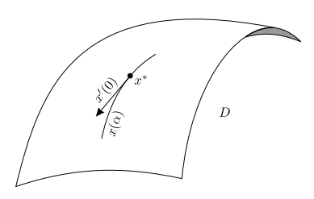

# Introduction

Xavier at 181030

## Optimal Control Problem

*Control system*, which **generates possible behaviors**, presents by ODEs of the form:
$$
% bbox
% \bbox[#EEF, 5px, border: 2px solid #880015]{E=mc^2}
% \bbox[9px, border:2px solid #880015]{abc}
% text size
% tiny scriptsize small normalsize large Large LARGE huge Huge
% color
% Aquamarine, black, blue, brown, cyan, darkgray, gray, green, lightgray, lime, magenta, olive, orange, pink, purple, red, teal, violet, white, yellow
\DeclareMathOperator*{\argmin}{argmin}
\DeclareMathOperator*{\argmax}{argmax}
\DeclareMathOperator*{\plim}{plim}
\newcommand{\space}{\;\;}
\newcommand{\bspace}{\;\;\;}
\newcommand{\Bspace}{\;\;\;\;}
\newcommand{\bbspace}{\;\;\;\;\;}
\newcommand{\BBspace}{\;\;\;\;\;\;}
\newcommand{\QQQ}{\boxed{?\:}}
\newcommand{\void}{\left.\right.}
\newcommand{\myEmphy}[2][#880015]{\color{#1}{#2}}
\newcommand{\myEmphyQ}{\color{#880015}}
\newcommand{\myBox}[2][9px, border:2px solid #880015]{\bbox[#1]{#2}}
\newcommand{\myBoxQ}{\bbox[9px, border:2px solid #880015]}
\newcommand{\ffrac}[2]{\displaystyle{\frac{#1}{#2}}}
\newcommand{\d}[1]{\displaystyle{#1}}
\newcommand{\Tran}[1]{{#1}^{\mathrm{T}}}
\newcommand{\CB}[1]{\left\{ #1 \right\}}
\newcommand{\SB}[1]{\left[ #1 \right]}
\newcommand{\Pare}[1]{\left( #1 \right)}
\newcommand{\abs}[1]{\left| #1 \right|}
\newcommand{\norm}[1]{\left\| #1 \right\|}
\newcommand{\given}[1]{\left. #1 \right|}
\newcommand{\using}[1]{\stackrel{\mathrm{#1}}{=}}
\newcommand{\asim}{\overset{\text{a}}{\sim}}
\newcommand{\RR}{\mathbb{R}}
\newcommand{\EE}{\mathbb{E}}
\newcommand{\II}{\mathbb{I}}
\newcommand{\NN}{\mathbb{N}}
\newcommand{\ZZ}{\mathbb{Z}}
\newcommand{\QQ}{\mathbb{Q}}
\newcommand{\PP}{\mathbb{P}}
\newcommand{\AcA}{\mathcal{A}}
\newcommand{\FcF}{\mathcal{F}}
\newcommand{\CcC}{\mathcal{C}}
\newcommand{\AsA}{\mathscr{A}}
\newcommand{\FsF}{\mathscr{F}}
\newcommand{\dd}{\mathrm{d}}
\newcommand{\I}[1]{\mathrm{I}\left( #1 \right)}
\newcommand{\N}[1]{\mathcal{N}\left( #1 \right)}
\newcommand{\Exp}[1]{\mathrm{E}\left[ #1 \right]}
\newcommand{\Var}[1]{\mathrm{Var}\left[ #1 \right]}
\newcommand{\Avar}[1]{\mathrm{Avar}\left[ #1 \right]}
\newcommand{\Cov}[1]{\mathrm{Cov}\left( #1 \right)}
\newcommand{\Corr}[1]{\mathrm{Corr}\left( #1 \right)}
\newcommand{\ExpH}{\mathrm{E}}
\newcommand{\VarH}{\mathrm{Var}}
\newcommand{\AVarH}{\mathrm{Avar}}
\newcommand{\CovH}{\mathrm{Cov}}
\newcommand{\CorrH}{\mathrm{Corr}}
\newcommand{\ow}{\text{otherwise}}
\newcommand{\wp}{\text{with probability}\space}
\newcommand{\FSD}{\text{FSD}}
\newcommand{\SSD}{\text{SSD}}
\newcommand{\tinyText}[1]{\tiny{\text{#1}}}
\newcommand{\scriptsizeText}[1]{\scriptsize{\text{#1}}}
\newcommand{\footnotesizeText}[1]{\footnotesize{\text{#1}}}
\newcommand{\smallText}[1]{\small{\text{#1}}}
\newcommand{\largeText}[1]{\large{\text{#1}}}
\newcommand{\LargeText}[1]{\Large{\text{#1}}}
\newcommand{\LARGEText}[1]{\LARGE{\text{#1}}}
\newcommand{\hugeText}[1]{\huge{\text{#1}}}
\newcommand{\HugeText}[1]{\Huge{\text{#1}}}
\newcommand{\labeltag}[1]{\tag{#1}\label{#1}}
\newcommand{\eg}[1]{\myEmphyQ{\largeText{Example.#1}}\;}
\newcommand{\ex}[1]{\myEmphyQ{\largeText{Exercise.#1}}\;}
\newcommand{\lma}[1]{\myEmphyQ{\largeText{Lemma.#1}}\;}
\newcommand{\pf}{\myEmphyQ{\largeText{Proof}}\;}
\newcommand{\rmk}[1]{\myEmphyQ{\largeText{Remark.#1}}\;}
\newcommand{\Rmk}{\myEmphyQ{\largeText{Remark}}\;}
\newcommand{\theorem}[1]{\myEmphyQ{\largeText{Theorem.#1}}\;}
\newcommand{\QED}{\myEmphyQ{\blacksquare}}
\dot{x} = f\Pare{t,x,u},\bspace x\Pare{t_0} = x_0 \labeltag{1}
$$
- $x$: *state* taking values in $\RR^n$, and $x_0$ is the *initial state*.
- $u$: *control input*, taking values in some *control set* $U \in \RR^m$
- $t$: *time*, $t_0$ is the *initial time*. 
- Both $x$ and $u$ are **functions** of $t$, which is often suppressed.

*Cost functional*, which **associates a cost with each possible behavior**. With initial data $\Pare{t_0,x_0}$, the behaviors are parameterized by control functions $u$. And then cost functional assigns a cost value to each admissible control. It's presented by an integral of the form:
$$
J\Pare{u}:=\int_{t_0}^{t_f} L\Pare{t,x\Pare{t},u\Pare{t}}\;\dd t + K\Pare{t_f,x_f} \labeltag{2}
$$
- $L$ is the *running cost*
- $K$ is the *terminal cost*
- $t_f$ is the *final time*, $x\Pare{t_f}$ is the *final state*.
- Note that $u$ is a **function**, so $J$ is a **functional**.

*Optimal control problem*: to find a control $u$ that **minimize** $J\Pare u$ over all admissible controls (or at least over nearby controls).

And later to ensure that the <u>state trajectories</u> of the control system are **well defined**, certain regularity properties should be imposed on the function $f$ and on the admissible controls $u$.

$\eg{1}$ Car moving on a horizontal line.

- $x\in \RR​$: the car's position
- $u\in U \subseteq \SB{-1,1}$: the control input, or the acceleration

Thus, the dynamics of the car are $\ddot x = u$ and we have the state $\d{\binom{x}{\dot x} \in \RR^2}$. Now, suppose that we want to "park" the car at the origin, in **minimal** time. To capture this objective using the cost functional, we could let $L\equiv 1$ as a constant running cost, and $K\equiv 0$ for there's no terminal cost, and a fixed final state $\d{\binom{0}{0}}$.

We'll solve this in Chapter04.

---

And we can also view the optimal control problem as that of choosing the best path among all paths feasible for the system, with respect to the given cost function. In this sense, the problem is *infinite-dimensional* for the space of paths is an infinite-dimensional function space. And this problem is also a *dynamic optimization problem*, for it involves a dynamical system and time. So here we'd recall the more standard static finite-dimensional optimization problem, about finding a minimum of a function $f: \RR^n\rightarrow \RR$.

## Some background on finite-dimensional optimization

Consider a function $f:\RR^n\rightarrow \RR$. Let $D \subseteq\RR^n$. Denote the standard Euclidean norm on $\RR^n$ as $\abs{\;\cdot\;}$.

A point $x^*\in D$ is a *local minimum* of $f$ over $D$ if $\exists\; \epsilon > 0$ $s.t.$ $\forall\; x\in D$, $\abs{x-x^*}<\epsilon$, we have
$$
f\Pare{x^*} \leq f\Pare{x}\labeltag{3}
$$

Thus, $x^*$ is a local minimum if in some ball around it, $f$ does not attain a value smaller than $f\Pare{x^*}$. Note that this refers only to points in $D$.

- *strict local minimum*: if the inequality in $\eqref{3}$ is strict for $x\neq x^*$
- *global minimum*: if $\eqref{3}$ holds for all $x\in D$. Default is a local one.
- *maximum*: similarly defined
- *extremum*: either a maximum or a minimum
- Note that maxima of $f$ is just the minima of $-f$, and thus later we will only focus on the minima, $i.e.$, a cost to be minimized, not a profit to be maximized

### Unconstrained optimization

The situation where all points $x$ sufficiently near $x^*$ in $\RR^n$ are in $D$, meaning that $x^*$ belongs to $D$ together with some $\RR^n$-neighborhood.

- *completely unconstrained*: $D=\RR^n$
- now we would assume $x^*$ as an interior point of $D$, and $D$ is an **open subset** of $\RR^n$

#### First-Order necessary condition for optimality

Suppose that $f$ is a $\CcC^1$, **continuous differentiable**, function and $x^*$ is its local minimum. $d\in \RR^n$ is an arbitrary vector. As in the unconstrained case, we have $x^*+\alpha d \in D$, $\forall\; \alpha \in \RR$ close enough to $0$.

Consider a new function of $\alpha$ for a fixed $d$,
$$
g\Pare{\alpha} :=f\Pare{x^*+\alpha d}\labeltag{4}
$$
whose domain is some interval containing $0$.

Since $x^*$ is a minimum of $f$, $0$ is also a minimum of $g$. This is how we transfer a function of a **vector** to a function of a **scalar variable**. In particular, we have the **first-order Taylor expansion** for $g$ around $\alpha = 0$:
$$
g\Pare{\alpha} = g\Pare{0} + g'\Pare{0}\cdot\alpha + o\Pare{\alpha}\labeltag{5}
$$
where $o\Pare{\alpha}$ represents "higher-order terms" which go to $0$ faster than $\alpha$ as $\alpha$ approaches $0$, $i.e.$,
$$
\lim_{\alpha\to 0}\dfrac{o\Pare{\alpha}}{\alpha} = 0\labeltag{6}
$$
$\Rmk$ Here we show that
$$
g'\Pare{0} = 0\labeltag{7}
$$
later we will translate this result in terms of $f$.

$\pf$ Suppose that $g'\Pare{0} \neq 0$. From $\eqref{6}$, we know $\exists \;\epsilon > 0$ small enough $s.t.$ for $\abs{\alpha}<\epsilon$, $\abs{\dfrac{o\Pare{\alpha}}{\alpha}}<\abs{g'\Pare 0}$. We write $\abs\alpha < \epsilon \Rightarrow \abs{o\Pare\alpha}< \abs{g'\Pare0 \alpha}$. Thus for these values of $\alpha$, using $\eqref5$, we see that
$$
g\Pare\alpha - g\Pare0 < g'\Pare 0\alpha + \abs{g'\Pare0\alpha}\labeltag{8}
$$
So if we restrict $\alpha$ to have the opposite sign to $g'\Pare{0}$, then the right-hand side of $\eqref{8}$ becomes $0$ and we obtain $g\Pare\alpha<g\Pare0$, however this contradicts the fact that $g$ has a minimum at $0$. $\QED$

---

Now that we have $g'\Pare0 = 0$, what about $f$? First we need to find the relationship between $f$ and $g'$. Using chain rule from vector calculus, we have
$$
g'\Pare\alpha = \nabla f\Pare{x^*+\alpha d}\cdot d\labeltag{9}
$$
where $\nabla f:=\Tran{\Pare{f_{x_{1}},\dots,f_{x_n}}}$, the *gradient* of $f$, and the $\cdot$ in $\eqref9$ denotes the inner product. Also note that $f_{x_i} := \dfrac{\partial f}{\partial x_i}$. Setting $\alpha=0$ in $\eqref9$, we have
$$
g'\Pare0=\nabla f\Pare{x^*}\cdot d = 0\labeltag{10}
$$
Since $d$ was **arbitrary**, we conclude that
$$
\myBoxQ{\nabla f\Pare{x^*} = 0}\labeltag{11}
$$
And this is the **first-order necessary condition for optimality**. Here $x^*$ is called a *stationary point*.

#### Second-Order conditions for optimality

Suppose that $f$ is a $\CcC^2$ function, **twice continuously differentiable**. And assume $x^*$ is a **local minimum**. Similarly, we write
$$
g\Pare\alpha = g\Pare0+g'\Pare0\alpha+\dfrac{1}{2}g''\Pare0\alpha^2 + o\Pare{\alpha^2}\labeltag{12}
$$
where
$$
\lim_{\alpha\to 0}\dfrac{o\Pare{\alpha^2}}{\alpha^2} = 0\labeltag{13}
$$
By the first-order necessary condition, we have $g'\Pare{0} = 0$. Then,

$\Rmk$ Here we have
$$
g''\Pare 0 \geq 0\labeltag{14}
$$
before writing the condition in terms of $f$.

$\pf$ Suppose $g''\Pare 0 < 0$. From $\eqref{13}$ we know that $\exists \;\epsilon>0$ $s.t.$ for $\abs{\alpha}<\epsilon$, $\abs{\dfrac{o\Pare{\alpha^2}}{\alpha^2}}<\dfrac{1}{2}\abs{g''\Pare 0}$, thus we have $\abs\alpha < \epsilon \Rightarrow \abs{o\Pare{\alpha^2}}<\dfrac{\abs{g''\Pare0}\alpha^2}{2} = -\dfrac{g''\Pare0\alpha^2}{2}$. So for these $\alpha$, $\Pare{12}$ reduces to $g\Pare\alpha - g\Pare0 < g'\Pare0\alpha = 0$, contradicting the fact that $0$ is a minimum of $g$. $\QED$

---

And now to move to $f$, we first find their relationship.

Since $\d{g'\Pare\alpha = \nabla f\Pare{x^*+\alpha d}\cdot d = \sum_{i=1}^n f_{x_i}\Pare{x^*+\alpha d}d_i}$, we differentiate both sides with respect to $\alpha$ and obtain
$$
g''\Pare{0} =\sum_{i,j=1}^n f_{x_ix_j}\Pare{x^*}d_id_j = \Tran d \nabla^2f\Pare{x^*}d\labeltag{15}
$$
where $\nabla^2 f:= \begin{pmatrix} f_{x_1x_1} & \cdots & f_{x_1x_n}\\
\vdots & \ddots & \vdots \\
f_{x_nx_1} & \cdots & f_{x_nx_n}
\end{pmatrix}$, the *Hessian matrix* of $f$. Thus from the fact that $d$ is **arbitrary**, we conclude that matrix $\nabla^2 f$ must be **positive semidefinite**. And the **second-order necessary condition for optimality** is presented as
$$
\myBox{\nabla^2 f\Pare{x^*} \geq 0, \text{positive semidefinite}} \tag{16}\label{16}
$$

---

- Both first and second only apply to the **unconstrained** case
- the second-order condition varies from **minima** to **maxima**: at a local minimum, the Hessian $\nabla^2 f$ is **negative semidefinite**; at a local maximum, the Hessian is **positive semidefinite**

$\Rmk$ **second-order sufficient condition for optimality**

If $f$ is a $\CcC^2$ function and satisfies:

- $\nabla f\Pare{x^*} = 0$, first-order condition
- $\nabla^2 f\Pare{x^*}>0$, **positive definite**, "strict" second-order condition

where $x^*$ is an interior point in its domain, then $x^*$ is a **strict local minimum** of $f$.

$\pf$ Still we take an arbitrary vector $d\in \RR^n$ and let $g\Pare\alpha = f\Pare{x^*+\alpha d}$. Use whatever we have to rewrite equation $\eqref{12}$: $g\Pare\alpha = g\Pare0+g'\Pare0\alpha+\dfrac{1}{2}g''\Pare0\alpha^2 + o\Pare{\alpha^2}$

- $g\Pare\alpha = f\Pare{x^*+\alpha d}$
- $g\Pare0= f\Pare{x^*+0} = f\Pare{x^*}$
- $g'\Pare{0} = \nabla f\Pare{x^*}\cdot d$, as shown in $\eqref{10}$. Since $\nabla f\Pare{x^*}=0$, $g'\Pare0 = 0$
- $g''\Pare0 = \Tran d\nabla^2 f\Pare{x^*}d$, as shown in $\eqref{15}$

we have
$$
f\Pare{x^*+\alpha d} = f\Pare{x^*} +\dfrac{\alpha^2}{2}\Tran d\nabla^2 f\Pare{x^*}d + o\Pare{\alpha^2}\labeltag{17}
$$
Note that $\dfrac{\Tran d\nabla^2 f\Pare{x^*}d}{2}$ is still a number thus from $\eqref{13}$, $\exist \; \epsilon>0$ small enough $s.t.$
$$
\abs\alpha < \epsilon, \alpha\neq 0 \bspace\Rightarrow\bspace \abs{o\Pare{\alpha^2}}<\dfrac{\alpha^2}{2}\Tran d\nabla^2 f\Pare{x^*}d
$$
And for these values of $\alpha$ we deduce from $\eqref{17}$ that $f\Pare{x^*+\alpha d}>f\Pare{x^*}$.

With this, we then indicate that $x^*$ is a (strict) local minimum. To do so, we need to show that $f\Pare{x^*}$ is the lowest value of $f$ in some **ball** around $x^*$. The difficulty is that the term $o\Pare{\alpha^2}$ and hence the value of $\epsilon$ depend on the direction of $d$.

However, this dependency is **continuous**, since all other term in $\eqref{17}$ are continuous in $d$. So without loss of generality, we now suppose $d$ is of unit length. Since the unit sphere in $\RR^n$ is **compact**, we have the minimum of $\epsilon$ over all such $d$, thanks to the **Weierstrass Theorem**. And this $\epsilon$ is the radius of the ball, where the lowest value of $f$ is archived at $x^*$. $\QED$

$\Rmk$ The above three proofs, are all with a key thought: $\exist \; \epsilon>0$ small enough $s.t.$ $\abs\alpha < \epsilon, \alpha\neq 0 \bspace\Rightarrow\bspace \abs{o\Pare{\alpha^2}}<\dfrac{\alpha^2}{2}\Tran d\nabla^2 f\Pare{x^*}d$, by the definition of higher-order terms, $\eqref{6}$, $\eqref{13}$.

#### Feasible directions, global minima, and convex problems

All previous will fail if $D$ has a boundary, say a closed ball. If $x^*$ is a point on the boundary, then we cannot ensure that $\forall\; d \in \RR^n$, $\CB{x^*+\alpha d}\subset D$ for $\alpha$ sufficient close to $0$. There'll be no unconstrained optimization.

However we can fix that. Define *feasible direction* $d$ at $x^*$, if $x^*+\alpha d \in D$ for small enough $\alpha>0$. We are now facing the problem that not all directions $d$ are feasible. Then the first-order condition $\nabla f\Pare{x^*} = 0$ is fault. So we'll only consider those feasible directions.

Still we define $g\Pare{\alpha}$ like $\eqref{4}$ for all feasible directions.

$\Rmk$ For all feasible directions, $g'\Pare{0}\geq 0$.

$\pf$ If not, suppose $g'\Pare0<0$. Note that $\alpha$ is **nonnegative**. So following the same procedure, we have
$$
g\Pare\alpha - g\Pare0 < g'\Pare 0\alpha + \abs{g'\Pare0\alpha} = 0
$$
which still contradicts with the fact that $0$ is a minimum of $g$. $\QED$

$\Rmk$ For all feasible directions satisfying $\nabla f\Pare{x^*}\cdot d = 0$, we have $\Tran d\nabla^2 f\Pare{x^*}d \geq0$.

$\pf$ Just like the proof of $\eqref{14}$, if $\nabla f\Pare{x^*}\cdot d = 0$, we have $g'\Pare{0}=0$, then similarly we have $\Tran d\nabla^2 f\Pare{x^*}d \geq0$. $\QED$

---

Considering *Convex set* $D$, line segment connecting $x^*$ to an arbitrary other point $x\in D$ lies entirely in $D$. Thus we can define a feasible direction following this line. However if $D$ is **not convex**, then the first-order and second-order necessary conditions in terms of feasible directions are **conservative**.

$\ex{1}$ Suppose that $f$ is a $\CcC^2$ function and $x^*$ is a point of its domain where for every nonzero feasible direction $d$ we have

- $\nabla f\Pare{x^*}\cdot d \geq 0$
- $\Tran d\nabla^2 f\Pare{x^*}d >0$

Is $x^*$ necessarily a local minimum of $f$?

---

In practice, how to find a **global** minimum over a given domain (or constraint set) $D$ is more interesting. Actually, conditions for local optimality can be useful for solving global optimization problems, provided that these global problems have some features.

$\Rmk$ **Weierstrass Theorem**

If $f$ is a **continuous** function and $D$ is a **compact** set, then there exists a global minimum of $f$ over $D$. Note that there're three way to define the compactness:

1. $D$ is compact if it is **closed** and **bounded**
2. $D$ is compact if every **open cover** of $D$ has a **finite subcover**
3. $D$ is compact if every sequence in $D$ has a subsequence converging to some point in $D$ (sequential compactness).

So here's how we find the global minimum.

1. *stationary points*: interior points of $D$ with $\nabla f\Pare{x^*} = 0$
2. *critical points*: stationary points **and** the points where $\nabla f$ doesn't exist
3. some boundary points with $\nabla f\Pare{x^*}\cdot d \geq 0$ for all feasible $d$
4. find one $x$, from the above points with smallest $f\Pare{x}$

Particularly, if $D$ is a **convex set** and $f$ is a **convex function**, then the minimization problem is tractable.

- a local minimum is automatically a global one
- the first-order necessary condition is also a sufficient one

### Constrained optimization

Now suppose that $D$ is a surface in $\RR^n$ defined by constraints: *equality constraints*
$$
h_1\Pare{x}=h_2\Pare{x} = \cdots = h_m\Pare{x} = 0 \labeltag{18}
$$
where 

- $h_i$, $i=1,2,\dots,m$ are $\CcC^1$ functions, **continuous differentiable**
- $h_i: \RR^n \mapsto \RR$
- Also assume that $f$ is a $\CcC^1$ function and we are studying its minimum over $D$

#### First-Order necessary condition (Lagrange multipliers)

1. Let $x^∗ \in D$ be a local minimum of $f$ over $D$. 
2. Assume $x^*$ to be a *regular point* of $D$: where the gradients (vector) $\nabla h_i$, $i=1,2,\dots,m$ are **linearly independent**

As a constraint optimization problem, we can't use the line segments $x^*+\alpha d$, but a curve that go through $x^*$. Here's how the arbitrary curves are found:

1. find a family of points $x\Pare\alpha \in D$, parameterized by $\alpha \in \RR$
2. $x\Pare0 = x^*$
3. $x\Pare\cdot$ is a $\CcC^1$, at least for $\alpha$ near $0$

Now with $x\Pare\alpha$, consider function $g\Pare\alpha := f\Pare{x\Pare\alpha}$.

$\Rmk$ If without the equality constraints, $\eqref{4}$ can be seen as an special case of $g\Pare\alpha = f\Pare{x\Pare\alpha}$.

Since $0$ is a minimum of $g$, similarly we have $g'\Pare{0} = 0$. In terms of $f$, we write 
$$
g'\Pare\alpha = \nabla f\Pare{x\Pare{\alpha}}\cdot x'\Pare\alpha \bspace\Rightarrow\bspace g'\Pare0 = \nabla f\Pare{x^*}\cdot x'\Pare0=0 \labeltag{19}
$$
$\Rmk$ It's the inner product of two vectors is zero (perpendicular?). And more about $x'\Pare0$:

- $x'\Pare0$ defines a linear approximation of $x\Pare\cdot$ at $x^*$, using the Tylor expansion: $x\Pare\alpha = x^*+ x'\Pare{0}\alpha + o\Pare\alpha$
- $x'\Pare0$ is a *tangent vector* to $D$ at $x^*$, geometrically, and specifies the infinitesimal direction of the curve $x\Pare\alpha$.
- we say that $x'\Pare0$ *lives in the tangent space* to $D$ at $x^*$, which is denoted by $T_{x^*}D$

---

Then we need an explicit characterization of the tangent space $T_{x^*}D$. First, we'll take a look at surface $D$, as is defined in $\eqref{18}$, and since the points $x\Pare\alpha$ lie in $D$ by construction, we have $h_i\Pare{x\Pare\alpha}=0$ for all $\alpha$ and all $i \in \CB{1,\dots,m}$. Differentiating this formula gives

$$
0 = \dfrac{\dd}{\dd \alpha}h_i\Pare{x\Pare\alpha} = \nabla h_i\Pare{x\Pare\alpha} \cdot x'\Pare\alpha, \bspace i = 1,2,\dots,m
$$

Remember this holds for all $\alpha$ close enough to $0$. Then, letting $\alpha = 0$ and since $x\Pare 0 = x^*$, we obtain:

$$
0 = \given{\dfrac{\dd}{\dd \alpha}}_{\alpha = 0} h_i\Pare{x \Pare\alpha} = \nabla h_i\Pare{x^*} \cdot x'\Pare 0, \bspace i = 1,2,\dots,m
$$

Since for an arbitray $\CcC^1$ curve $x\Pare\cdot$ in $D$ with $x\Pare 0 = x^*$, its tangent vector $x'\Pare 0$ must satisfy $\nabla h_i\Pare{x^*} \cdot x'\Pare 0 = 0$ for each $i$.

$\Rmk$ Actually, it's also true that every vector $d \in \RR^n$ satisfying

$$
\nabla \Pare{x^*} \cdot d = 0, \bspace i = 1,2,\dots,m \labeltag{20}
$$

is a tangent vector to $D$ at $x^*$ corresponding to some curve. The proof of this relies on $x^*$ being a regular point of $D$.

Thus, *the tangent vectors to $D$ at $x^*$ are exactly the vectors $d$ for which $\eqref{20}$ holds*.

And this is the characterization of the tangent space $T_{x^*}D$. And it's clear that *$T_{x^*}D$ is a **subspace**  of $\RR^n$*. Also, if $d$ is a tangent vector, then so is $-d$.

---

Go back to $\eqref{19}$, which says that $g'\Pare0 = \nabla f\Pare{x^*}\cdot x'\Pare0=0$ for all $d \in T_{x^*}D$, thus we now rewrite this condition as:

$$
\nabla f\Pare{x^*} \cdot d = 0 \bspace \forall d s.t. \nabla h_i\Pare x^* \cdot d = 0, \bspace i = 1,\dots ,m \labeltag{21}
$$

And we can make $\eqref{21}$ more explicit by eliminate $d$ in the conditoin. We first have a claim:

*Claim*: The gradient of $f$ at $x^*$ is a linear comination of the gradients of the constraint functions $h_1,\dots,h_m$ at $x^*$, namely:

$$
\nabla f\Pare x^* \in \text{span}\CB{\nabla h_i \Pare x^* , i=1,\dots,m}.\labeltag{22}
$$

$\pf$ Indeed, if this is not true, then $\nabla f\Pare x^*$ has a component **orthogonal** to $\text{span}\CB{\nabla h_i \Pare x^*$, $i.e.$,

$$
\exists d \neq 0, s.t. \nabla h_i \Pare x^* \cdot d = 0, \bspace i=1,\dots,m \labeltag{23}
$$

and $\nabla f\Pare{x^*}$ can be written in the form

$$
\nabla f\Pare x^* = d - \sum_{i=1}^{m} \lambda_i^* \nabla h_i\Pare x^* \labeltag{24}
$$

for some $\lambda_1^*,\dots,\lambda_m^* \in \RR$. Taking the inner product with $d$ on both sides of $\eqref{23}$ and $\eqref{24}$, we have

$$
\nabla f\Pare x^* \cdot d = d\cdot d \neq 0
$$

which is a contracdiction with $\eqref{21}$.

---