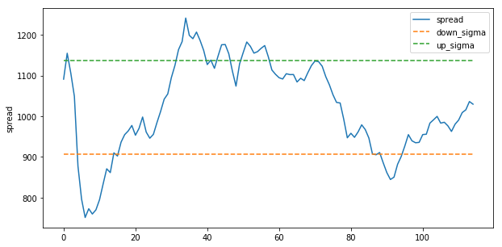

11510806 HU XIAOYI  
11510810 HE WANTING  
In our project we explore the relation between commodity prices and the CPI.
We collect the time series of both indexes, explore the cointegration between them and finally discuss the implications.


```python
import numpy as np
import pandas as pd
import matplotlib.pyplot as plt
import datetime as dt
import scipy.stats as scs
import statsmodels.api as sm
from arch.unitroot import PhillipsPerron
```

# Get data

We use data of American monthly CPI index from year 1978 to year 2017.  
Here the Consumer Price Index research series using current methods (CPI-U-RS) presents an estimate of the CPI for all Urban Consumers (CPI-U) from 1978 to present that incorporates most of the improvements made over that time span into the entire series.


```python
# Use American monthly CPI index from year 1978 to year 2017, seasonally adjusted, available at
# https://www.bls.gov/cpi/research-series/allitems.xlsx
rawdata = pd.read_excel('AmeriCPI.xlsx', sheetname=1, header = 6)
rawdata.head()
```


<div>
<table border="1" class="dataframe">
  <thead>
    <tr style="text-align: right;">
      <th></th>
      <th>YEAR</th>
      <th>JAN</th>
      <th>FEB</th>
      <th>MAR</th>
      <th>APR</th>
      <th>MAY</th>
      <th>JUNE</th>
      <th>JULY</th>
      <th>AUG</th>
      <th>SEP</th>
      <th>OCT</th>
      <th>NOV</th>
      <th>DEC</th>
      <th>AVG</th>
    </tr>
  </thead>
  <tbody>
    <tr>
      <th>0</th>
      <td>1977</td>
      <td>NaN</td>
      <td>NaN</td>
      <td>NaN</td>
      <td>NaN</td>
      <td>NaN</td>
      <td>NaN</td>
      <td>NaN</td>
      <td>NaN</td>
      <td>NaN</td>
      <td>NaN</td>
      <td>NaN</td>
      <td>100.3</td>
      <td>NaN</td>
    </tr>
    <tr>
      <th>1</th>
      <td>1978</td>
      <td>100.8</td>
      <td>101.3</td>
      <td>101.8</td>
      <td>102.7</td>
      <td>103.6</td>
      <td>104.2</td>
      <td>104.7</td>
      <td>105.3</td>
      <td>106.1</td>
      <td>106.7</td>
      <td>107.4</td>
      <td>108.2</td>
      <td>104.4</td>
    </tr>
    <tr>
      <th>2</th>
      <td>1979</td>
      <td>109.0</td>
      <td>109.9</td>
      <td>110.8</td>
      <td>111.8</td>
      <td>112.8</td>
      <td>114.0</td>
      <td>115.0</td>
      <td>115.9</td>
      <td>116.7</td>
      <td>117.9</td>
      <td>118.6</td>
      <td>119.8</td>
      <td>114.3</td>
    </tr>
    <tr>
      <th>3</th>
      <td>1980</td>
      <td>121.2</td>
      <td>122.6</td>
      <td>123.8</td>
      <td>124.6</td>
      <td>125.6</td>
      <td>126.4</td>
      <td>127.4</td>
      <td>128.5</td>
      <td>129.8</td>
      <td>130.6</td>
      <td>131.7</td>
      <td>132.5</td>
      <td>127.0</td>
    </tr>
    <tr>
      <th>4</th>
      <td>1981</td>
      <td>133.9</td>
      <td>135.4</td>
      <td>136.5</td>
      <td>137.1</td>
      <td>137.8</td>
      <td>138.5</td>
      <td>139.6</td>
      <td>140.5</td>
      <td>141.7</td>
      <td>142.4</td>
      <td>143.1</td>
      <td>143.6</td>
      <td>139.2</td>
    </tr>
  </tbody>
</table>
</div>


As researched by *R.A. Pecchenino(1992)*, the CPI is considered cointegrated with the commodity price indices. Here we use the  Dow Jones Commodity Index as our data resources.


```python
# The CPI is considered cointegrated with the commodity price indices, as researched by R.A. Pecchenino(1992)
rawdata2 = pd.read_excel('DJCI.xls', header = 6, skip_footer=129)
# TR: total return, ER: excess return
rawdata2.head()
```


<div>
<table border="1" class="dataframe">
  <thead>
    <tr style="text-align: right;">
      <th></th>
      <th>Effective date</th>
      <th>Dow Jones Commodity Index TR</th>
      <th>Dow Jones Commodity Index ER</th>
      <th>Dow Jones Commodity Index</th>
    </tr>
  </thead>
  <tbody>
    <tr>
      <th>0</th>
      <td>2008-05-30</td>
      <td>562.18</td>
      <td>410.73</td>
      <td>682.15</td>
    </tr>
    <tr>
      <th>1</th>
      <td>2008-06-02</td>
      <td>566.74</td>
      <td>414.00</td>
      <td>687.58</td>
    </tr>
    <tr>
      <th>2</th>
      <td>2008-06-03</td>
      <td>559.74</td>
      <td>408.86</td>
      <td>679.04</td>
    </tr>
    <tr>
      <th>3</th>
      <td>2008-06-04</td>
      <td>556.23</td>
      <td>406.28</td>
      <td>674.75</td>
    </tr>
    <tr>
      <th>4</th>
      <td>2008-06-05</td>
      <td>567.26</td>
      <td>414.32</td>
      <td>688.11</td>
    </tr>
  </tbody>
</table>
</div>


```python
rawdata2 = rawdata2.iloc[1:,[0,3]]
rawdata2.index = range(len(rawdata2))
# remove an additional space, and remave the last column
rawdata2.columns = ['Effective date','DJCI']
```


```python
#resmaple the data by the time unit of months taking avergae
resampled = rawdata2.resample('M', on='Effective date').mean()
data_array2 = np.ravel(resampled)
```


```python
# The Dow Jones Commodity Index was recorded from 2018 the June, so we match the two
data_array1 = np.insert(rawdata.iloc[32:,1:13].values,0,rawdata.iloc[31,6:13])
```

# Stationary test


```python
# Phillips Perron test
# http://arch.readthedocs.io/en/latest/unitroot/tests.html#phillips-perron-testing
pp1 = PhillipsPerron(data_array1)
pp1
```


<table class="simpletable">
<caption>Phillips-Perron Test (Z-tau)</caption>
<tr>
  <td>Test Statistic</td>     <td>0.491</td>
</tr>
<tr>
  <td>P-value</td>            <td>0.985</td>
</tr>
<tr>
  <td>Lags</td>                  <td>13</td>
</tr>
</table><br/><br/>Trend: Constant<br/>Critical Values: -3.49 (1%), -2.89 (5%), -2.58 (10%)<br/>Null Hypothesis: The process contains a unit root.<br/>Alternative Hypothesis: The process is weakly stationary.


```python
# 'nc' indicates no trend component in the test
pp1.trend = 'nc'
pp1
```


<table class="simpletable">
<caption>Phillips-Perron Test (Z-tau)</caption>
<tr>
  <td>Test Statistic</td>     <td>3.512</td>
</tr>
<tr>
  <td>P-value</td>            <td>1.000</td>
</tr>
<tr>
  <td>Lags</td>                  <td>13</td>
</tr>
</table><br/><br/>Trend: No Trend<br/>Critical Values: -2.59 (1%), -1.94 (5%), -1.61 (10%)<br/>Null Hypothesis: The process contains a unit root.<br/>Alternative Hypothesis: The process is weakly stationary.


```python
pp2 = PhillipsPerron(data_array2)
pp2
```


<table class="simpletable">
<caption>Phillips-Perron Test (Z-tau)</caption>
<tr>
  <td>Test Statistic</td>    <td>-1.969</td>
</tr>
<tr>
  <td>P-value</td>            <td>0.301</td>
</tr>
<tr>
  <td>Lags</td>                  <td>13</td>
</tr>
</table><br/><br/>Trend: Constant<br/>Critical Values: -3.49 (1%), -2.89 (5%), -2.58 (10%)<br/>Null Hypothesis: The process contains a unit root.<br/>Alternative Hypothesis: The process is weakly stationary.


```python
# 'ct' indicates a constant and linear time trend in the test
pp2.trend = 'ct'
pp2
```


<table class="simpletable">
<caption>Phillips-Perron Test (Z-tau)</caption>
<tr>
  <td>Test Statistic</td>    <td>-1.950</td>
</tr>
<tr>
  <td>P-value</td>            <td>0.628</td>
</tr>
<tr>
  <td>Lags</td>                  <td>13</td>
</tr>
</table><br/><br/>Trend: Constant and Linear Time Trend<br/>Critical Values: -4.04 (1%), -3.45 (5%), -3.15 (10%)<br/>Null Hypothesis: The process contains a unit root.<br/>Alternative Hypothesis: The process is weakly stationary.


The *null hypothesis* of the **Phillips-Perron test** is that there is a unit root, with the *alternative* that there is no unit root. If the $p$ value is above a critical size, then the null cannot be rejected that there and the series appears to be a unit root. So here we can't reject the *null* and thus, it's *unstationary*.

# Cointegration test and stationary test on the spread

Here we intend to run the regression:
$$Commodity\_price\_index_t = \alpha + \beta CPI_t +\delta_1 \Delta CPI_{t-1} + \delta_2 \Delta CPI_{t-2} + \gamma_1 \Delta CPI_{t+1}+ \gamma_2 \Delta CPI_{t+2}+e_t $$


```python
regression_data2 = data_array2[5:]
regression_data1 = data_array1[5:]
delta_data_array1 = data_array1[:-1] - data_array1[1:]
delta_tp2 = delta_data_array1[4:]
delta_tp1 = delta_data_array1[3:-1]
delta_tm1 = delta_data_array1[1:-3]
delta_tm2 = delta_data_array1[:-4]
```


```python
# Find the cointgration parameter
regression_matrix = sm.add_constant(np.array([regression_data1,delta_tm1,delta_tm2,delta_tp1,delta_tp2]).T)
model = sm.OLS(regression_data2,regression_matrix)
results = model.fit()
```


```python
# coefficients: alpha, beta, detla_1, delta_2, gamma_1, gamma_2
results.params
```


    array([ 978.27893045,   -1.1649586 ,  -27.56662999,  -29.45654111,
            -31.77281647,  -19.26055131])


|parameter|value|
|-|-|
|$\alpha$|978.27893045|
|$\beta$|-1.1649586|
|$\delta_1$|-27.56662999|
|$\delta_2$| -29.45654111|
|$\gamma_1$|-31.77281647|
|$\gamma_2$|-19.26055131|


```python
beta = results.params[1]
```

Cointegration is defined as following: If ${y_t: t = 0,1,...} and {x_t: t=0,1,...}$ are two I(1) processes, then, in general, $y_t - \beta x_t$ is an I(1) process for any number $\beta$. Nevertheless, it is *possible* that for some $\beta \neq 0$, $y_t - \beta x_t$ is an I(0) process, which means it has constant mean, constant variance, and autocorrelations that depend only on the time distance between two variables. If such a $\beta$ exists, we say that $y$ and $x$ are $cointegrated$, and we call $\beta$ the cointegration parameter.  
So now we compute the new series spread $$spread_t = Commodity\_price\_index_t - \beta CPI_t $$


```python
# Phipplip Perron test on the spread
spread = data_array2 - beta*data_array1
pp3 = PhillipsPerron(spread)
pp3
```


<table class="simpletable">
<caption>Phillips-Perron Test (Z-tau)</caption>
<tr>
  <td>Test Statistic</td>    <td>-1.969</td>
</tr>
<tr>
  <td>P-value</td>            <td>0.300</td>
</tr>
<tr>
  <td>Lags</td>                  <td>13</td>
</tr>
</table><br/><br/>Trend: Constant<br/>Critical Values: -3.49 (1%), -2.89 (5%), -2.58 (10%)<br/>Null Hypothesis: The process contains a unit root.<br/>Alternative Hypothesis: The process is weakly stationary.


```python
# 'ct' indicates a constant and linear time trend in the test
pp3.trend = 'ct'
pp3
```


<table class="simpletable">
<caption>Phillips-Perron Test (Z-tau)</caption>
<tr>
  <td>Test Statistic</td>    <td>-1.970</td>
</tr>
<tr>
  <td>P-value</td>            <td>0.617</td>
</tr>
<tr>
  <td>Lags</td>                  <td>13</td>
</tr>
</table>


According to the p-value, we cannot reject the null hypothesis that the process contains a unit root. If two series are cointegrated, this should be an I(0) process, this is a contradiction, so two series are not integrated.

# Include the spread, the ECM

As $x_t$ and $y_t$ are I(1) processes and are *not* integrated, we might estimate a model in first differences. The term $\delta(y_{t-1}-\beta x_{t-1})$ is called the *error correction term*, we can introduce its lag into the model and comstruct an error collection model. An error correction model allows us to study the short-run dynamics in the relationship between $x$ and $y$.


```python
demeaned_spread = spread - np.mean(spread)
demeaned_spread = demeaned_spread[5:]
```


```python
ECM_regression_data2 = data_array2[5:] - data_array2[4:-1]
ECM_delta2_tm1 = data_array2[4:-1] - data_array2[3:-2]
ECM_regression_matrix = np.array([demeaned_spread,ECM_delta2_tm1,delta_tm1]).T
ECM_model = sm.OLS(ECM_regression_data2,ECM_regression_matrix)
ECM_results = ECM_model.fit()
```


```python
# coefficients: theta_0, theta_1, theta_2
ECM_results.params
```


    array([-0.00329482,  0.34211161,  0.54969131])


# Plot


```python
fig = plt.figure()
fig.set_size_inches(10,5)
ax = fig.add_subplot(111)
A = ax.plot(spread,label='spread')
unit = np.ones_like(spread)
up_sigma = np.mean(spread) + np.std(spread)
up_sigma = up_sigma*unit
down_sigma = np.mean(spread) - np.std(spread)
down_sigma = down_sigma*unit
B = ax.plot(down_sigma,'--',label='down_sigma')
C = ax.plot(up_sigma,'--',label='up_sigma')
ax.legend()
ax.set_ylabel('spread')
```


    <matplotlib.text.Text at 0x147d1745c0>





```python
up_exceed = np.where(spread - up_sigma>0,True,False)
down_exceed = np.where(down_sigma - spread>0,True,False)
exceed = up_exceed|down_exceed
exceed_rate = len(exceed[exceed])/len(exceed)
exceed_rate
```


    0.34782608695652173


***
