# Bond portfolio management and immunization

$$
% bbox
% \bbox[#EEF, 5px, border: 2px solid #880015]{E=mc^2}
% \bbox[9px, border:2px solid #880015]{abc}
% text size
% tiny scriptsize small normalsize large Large LARGE huge Huge
% color
% aquamarine, black, blue, brown, cyan, darkgray, gray, green, lightgray, lime, magenta, olive, orange, pink, purple, red, teal, violet, white, yellow
\DeclareMathOperator*{\argmin}{argmin}
\DeclareMathOperator*{\argmax}{argmax}
\DeclareMathOperator*{\plim}{plim}
\DeclareMathOperator*{\span}{span}
\newcommand{\space}{\;\;}
\newcommand{\bspace}{\;\;\;}
\newcommand{\Bspace}{\;\;\;\;}
\newcommand{\bbspace}{\;\;\;\;\;}
\newcommand{\BBspace}{\;\;\;\;\;\;}
\newcommand{\QQQ}{\boxed{?\:}}
\newcommand{\void}{\left.\right.}
% \newcommand{\myEmphy}[2][#880015]{\color{#1}{#2}}
% \newcommand{\myEmphyQ}{\color{#880015}}
% \newcommand{\myBox}[2][9px, border:2px solid #880015]{\bbox[#1]{#2}}
% \newcommand{\myBoxQ}{\bbox[9px, border:2px solid #880015]}
\newcommand{\myEmphy}[2][#880015]{ {\color{#1}{#2}} }
\newcommand{\myBox}[2][9px, border:2px solid #880015]{ {\bbox[#1]{#2}} }
\newcommand{\d}[1]{ {\displaystyle{#1}} }
\newcommand{\Tran}[1]{{#1}^{\mathrm{T}}}
\newcommand{\CB}[1]{\left\{ #1 \right\}}
\newcommand{\SB}[1]{\left[ #1 \right]}
\newcommand{\Pare}[1]{\left( #1 \right)}
\newcommand{\abs}[1]{\left| #1 \right|}
\newcommand{\norm}[1]{\left\| #1 \right\|}
\newcommand{\given}[1]{\left. #1 \right|}
\newcommand{\using}[2][=]{\overset{\mathrm{#2}}{#1}}
\newcommand{\usingUD}[3][=]{\underset{\text{#2}}{\overset{\text{#3}}{#1}}}
\newcommand{\asim}{\overset{\text{a}}{\sim}}
\newcommand{\tinyText}[1]{ {\tiny{\text{#1}}} }
\newcommand{\scriptsizeText}[1]{ {\scriptsize{\text{#1}}} }
\newcommand{\footnotesizeText}[1]{ {\footnotesize{\text{#1}}} }
\newcommand{\smallText}[1]{ {\small{\text{#1}}} }
\newcommand{\largeText}[1]{ {\large{\text{#1}}} }
\newcommand{\LargeText}[1]{ {\Large{\text{#1}}} }
\newcommand{\LARGEText}[1]{ {\LARGE{\text{#1}}} }
\newcommand{\hugeText}[1]{ {\huge{\text{#1}}} }
\newcommand{\HugeText}[1]{ {\Huge{\text{#1}}} }
\newcommand{\RR}{\mathbb{R}}
\newcommand{\EE}{\mathbb{E}}
\newcommand{\FF}{\mathbb{F}}
\newcommand{\II}{\mathbb{I}}
\newcommand{\NN}{\mathbb{N}}
\newcommand{\ZZ}{\mathbb{Z}}
\newcommand{\QQ}{\mathbb{Q}}
\newcommand{\PP}{\mathbb{P}}
\newcommand{\AcA}{\mathcal{A}}
\newcommand{\CcC}{\mathcal{C}}
\newcommand{\FcF}{\mathcal{F}}
\newcommand{\IcI}{\mathcal{I}}
\newcommand{\AsA}{\mathscr{A}}
\newcommand{\FsF}{\mathscr{F}}
\newcommand{\IsI}{\mathscr{I}}
\newcommand{\dd}{\mathrm{d}}
\newcommand{\refs}[1]{ \tag{#1}\label{#1} }
\newcommand{\I}[1]{\mathrm{I}\left( #1 \right)}
\newcommand{\N}[1]{\mathcal{N}\left( #1 \right)}
\newcommand{\Exp}[1]{\mathrm{E}\left[ #1 \right]}
\newcommand{\Var}[1]{\mathrm{Var}\left[ #1 \right]}
\newcommand{\Avar}[1]{\mathrm{Avar}\left[ #1 \right]}
\newcommand{\Cov}[1]{\mathrm{Cov}\left( #1 \right)}
\newcommand{\Corr}[1]{\mathrm{Corr}\left( #1 \right)}
\newcommand{\ExpH}{\mathrm{E}}
\newcommand{\VarH}{\mathrm{Var}}
\newcommand{\AVarH}{\mathrm{Avar}}
\newcommand{\CovH}{\mathrm{Cov}}
\newcommand{\CorrH}{\mathrm{Corr}}
\newcommand{\ow}{\text{otherwise}}
\newcommand{\wp}{\text{with probability }}
\newcommand{\FSD}{\text{FSD}}
\newcommand{\SSD}{\text{SSD}}
\newcommand{\QED}{\myEmphy{\blacksquare}}
\newcommand{\SUM}{\myEmphy{\text{Summary}}}
\newcommand{\pf}{\myEmphy{\largeText{Proof}}}
\newcommand{\slu}{\myEmphy{\largeText{Solution}}}
\newcommand{\Corlr}{\myEmphy{\largeText{Corrollary}}}
\newcommand{\Rmk}{\myEmphy{\largeText{Remark}}}
\newcommand{\pops}[1]{\myEmphy{\largeText{Proposition #1}}}
\newcommand{\Pops}{\myEmphy{\largeText{Proposition}}}
\newcommand{\zrm}[1]{\myEmphy{\largeText{Theorem #1}}}
\newcommand{\Zrm}{\myEmphy{\largeText{Theorem}}}
\newcommand{\ppt}[1]{\myEmphy{\largeText{Property #1}}}
\newcommand{\Ppt}{\myEmphy{\largeText{Property}}}
\newcommand{\def}[1]{\myEmphy{\largeText{Definition #1}}}
\newcommand{\Def}{\myEmphy{\largeText{Definition}}}
\newcommand{\lm}[1]{\myEmphy{\largeText{Lemma #1}}}
\newcommand{\Lm}{\myEmphy{\largeText{Lemma}}}
\newcommand{\eg}[1]{\myEmphy{\largeText{Example #1}}}
\newcommand{\ex}[1]{\myEmphy{\largeText{Exercise.#1}}}
\newcommand{\rmk}[1]{\myEmphy{\largeText{Remark #1}}}
\myEmphy{\smallText{Xavier}}
$$

## Bond yield and term structure of interest rates

### Bonds

$\Def$ *Bond*

A **bond** is a debt instrument requiring the **issuer** to repay to the lender/**investor** the amount borrowed (**par** or **face value**) plus, **interest** over a specified period of time.

- **maturity date**: when the principal is repaid
- coupon payments over the life of the bond

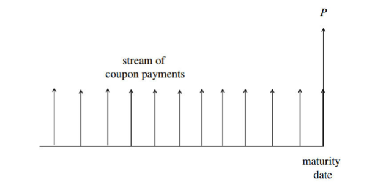

$\Rmk$

- The coupon rate represents the cost of the **raising capital**: the reflection of the creditworthiness of the bond issuer
- Assume:
  - bond issuer will not default
  - bond issuer will not redeem prior to the maturity date
  - investor is holding until maturity date
  - investor is assured to know the cash flow pattern

$\Def$ Markets

- **Exchange-traded** markets: The **clearing house** (结算行) takes care of **credit risk** by requiring *two* traders to deposit **funds** with the clearing house to ensure that they will live up to their obligations.
- **Over-the-counter** markets: The two parties can either present the trade to a central counterparty (CCP) or clear the trade bilaterally.

$\Def$ Bonds

- **Corporate** bond: Issued by *corporations* for the purpose of raising capital for operations and new ventures
  - Some are traded on an exchange
  - most are traded in the OTC markets in a network of bond dealers
- **Convertible** bond: The bondholder has the right to *exchange* the bond for a specified number of **shares** on a set of pre-specified dates or at maturity
  - Bondholders can take advantage of the future growth of the issuer's company
  - Issuer can raise capital at a lower coupon rate
- **Exchangeable** bond: The bondholder has the right to *exchange* the issue for a specified number of common stocks of *another* corporation.
- other features
  - **floating rate** bond: **coupon rates** are *reset periodically* according to some predetermined financial benchmark
  - **Amortization** (摊销) feature: principal is repaid over the life of the bond
  - **Callable** feature: The issuer has the right to *buy back* the bond at a specified price
    - usually this call price falls with time
    - there's an initial call protection period
  - **Put provision** feature: grants the bondholder the right to sell back to the issuer at **par value** (face value) on specified dates.

$\Rmk$ Share and Stock

Shares indicate the amount invested in one company whereas stocks indicate the money invested in one or many companies. 

A **Stock** is a collection of shares of a member that are fully paid up.

$\Def$ Risk associated

- **Interest rate risk**: The price of a typical bond will change in the *opposite* direction from a change in *interest rates*. Interest rates $\uparrow$, the price of a bond $\searrow$. The sensitivity of a bonds price to changes in interest rates depends on
  - coupon stream
  - remaining life of the bond
  - others
- **Default risk** (**credit risk**): risk that the issuer of a bond may *default* on his payment obligation
  - default risk is gauged by **quality ratings**
  - Bonds with default risk are priced lower than comparable **US Treasury securities** (considered as default free)
- **Inflation risk** (**purchasing-power risk**)
  - Variation in the *value* of cash flows from a bond due to *inflation*, as measured in terms of purchasing power
  - exempted if holding **floating-rate bonds**
- **Exchange rate risk**: foreign currency denominated bonds
- **Liquidity** (marketability) risk: measured by the size of the **bid-ask spreads** on the bond price

$\Def$ quantities

- **Time value of money**
  - **Future value**: $\largeText{present value} \times \largeText{compounding factor}$
  - **Present value**: $\largeText{future value} \times \largeText{discount factor}$
  - **Compounding factor**: $\myBox{\large{\Pare{1+\tilde r}^n}}$
    - $\tilde r$: interest rate over one time period
    - $n$: number of interest earning periods
  - **Discount factor**: $\Pare{1+\tilde r}^{-n}$
- **Continuous compounding**
  - $r$: interest rate per annum
  - $t$: total interest earning time period (in years)
  - compounding factor if $m$ compounding intervals per year: $\Pare{1+\dfrac{r}{m}}^{mt}$
  - as $m\to \infty$, compounding factor becomes $\myBox{\large{e^{rt}}}$

$\eg{}$ $r=8\%$, $t=2.5 \text{ y}$, principal $P_0$. Find interest if interest is compounded continuously, or semi-annually?

$\slu$

- continuous compounding

$$
P_0\Pare{e^{rt}-1} = P_0 \Pare{e^{0.08\times 2.5}-1} \approx 0.2217 P_0
$$

- semi-annual compounding

$$
P_0\Pare{\Pare{1+0.5r}^5-1} = P_0\Pare{1.04^5-1} = 0.2167P_0
$$

---

$\Zrm$ Continuous compounding

$t$: time

$M_t$: the money market account value at time $t$

$\implies$ interest collected over $\Delta t$: $r_tM_t\cdot \Delta t$

$\implies$ $M_{t+\Delta t} = M_t + r_tM_t\cdot \Delta t = \Pare{1+r_t \Delta t}M_t$

$\implies$ **growth factor** over $\Delta t$: $\myBox{\large{1+r_t \Delta t}}$

$\Bspace\Bspace$ $\dd M_t = r_t M_t \dd t$

$\implies$ integrate $\implies$ $\d{\int_{M_0}^{M_t}\frac{1}{M_s}\dd M_s = \int_0^t r_s\dd s\implies M_t = M_0 \exp\CB{\int_{0}^t r_s\dd s}}$

$\Rmk$

$$
\myBox{M_t = M_0 \exp\CB{\int_{0}^t r_s\dd s}}
$$
This remains valid when $r_t​$ is a *stochastic process*, when the growth factor and money market account all become stochastic.

$\Rmk$ 

Note that the growth factor over $\Delta t$ under continuous compounding is
$$
e^{r\Delta t} \approx 1+r\Delta t + \dfrac{r^2\Pare{\Delta t}^2}{2!}+ \dfrac{r^3\Pare{\Delta t}^3}{3!}+\cdots
$$

$\SUM$
$$
\begin{array}{ccc}
\hline
\text{compounding factor}&\text{constant } r&\text{various }r\\[0.7em] \hline
\text{discrete}&\Pare{1+\tilde r}^n & \prod\Pare{1+r_t\Delta t}\\[0.5em]
m\text{ times a year} & \Pare{1+\frac{r}{m}}^{mn} & \text{N/A}\\
\text{continuous}&e^{rt} & \exp\CB{\int_{0}^t r_s\dd s}\\[0.5em]
\hline
\end{array}
$$

### Rates

$\Def$ $n$-year Spot rate

The $n$-year **spot rate** is the *rate* of interest earned on a $n$-year *zero coupon riskless bond* that starts today and lasts for $n$ years.

$\eg{}$ Suppose a $5$-year spot rate with *continuous* compounding is quoted as $5\%$ per annum. That is, given $\$100$, if invested for $5$ years, it grows to what?

$\slu$
$$
100 \times e^{0.05\times 5} = 128.40
$$

$\def{}$ Discount bonds (zero-coupon bonds)

Bonds that *do not* pay any intermediate *coupons*, mostly with short maturity.

$Z_0$: price of discount bond

$F$: face value of discount bond

$\implies $ spot rate $i_t$: $Z_0\Pare{1+i_t}^t = F \implies \myBox{\large{i_t = \Pare{\dfrac{F}{Z_0}}^{1/t}-1}}$ (discrete compounding)

$\Zrm$ Discount bonds price (continuous compounding)

$n$-year unit par zero-coupon bond at the spot rate $i_t$ per annum is

$$
e^{-ni_t}
$$

$\Rmk $ The corresponding growth factors are $\Pare{1+i_t}^t$ and $e^{ni_t}$

$\Def$ **Forward interest rate**s

$f\Pare{0,t,T}$: Forward rate decided upon today (time $0$), for a loan starting at $t$ and reimbursed at $T$, also noted as $f_{t,T}$

$i\Pare{0,u} = f\Pare{0,0,u}​$: spot rate for a loan that starts at time $0​$ and is reimbursed at later time $u​$.

$\Zrm$
$$
\myBox{\SB{1+i\Pare{0,t}}^t \cdot \SB{1+f\Pare{0,t,T}}^{T-t} = \SB{1+i\Pare{0,T}}^T }\refs{1}
$$
$\pf$

- $RHS<LHS$

  To arbitrage, borrow $\$1$ for $T$ years at $i\Pare{0,T}$, lend this out for $t$ years at $i\Pare{0,t}$; at time $t$, invest the money paid $\SB{1+i\Pare{0,t}}^t$ at rate $f\Pare{0,t,T}$; at time $T$, win the delta.

$\QED$

$\eg{}$ $T=2$, $i\Pare{0,1}=5\%$, $i\Pare{0,2} = 4\%$, find $f\Pare{0,1,2}$

$\slu$ 
$$
\begin{align}
f\Pare{0,t,T} &= \Pare{\frac{\SB{1+i\Pare{0,T}}^T}{\SB{1+i\Pare{0,t}}^t}}^{T-t} - 1,\BBspace t<T \\
f\Pare{0,1,2} &= \frac{1.04^2}{1.05}-1=0.0301
\end{align}
$$
$\Rmk$ Generalization

find the $T $th root of $\eqref{1}$ on both side,
$$
\implies1+i\Pare{0,T} = \SB{1+i\Pare{0,t}}^{t/T}\SB{1+f\Pare{0,t,T}}^{\frac{T-t}{T}}
$$
suppose $t_1,t_2,\dots,t_n​$ are arbitrary partition of time horizon $\SB{0,T}​$ with $t_0=0​$ and $t_n=T​$

$\implies i\Pare{0,t_1} = f\Pare{0,t_0,t_1}$
$$
\implies \myBox{ 1+i\Pare{0,t_n} = \prod_{j=1}^n \SB{1+f\Pare{0,t_{j-1},t_j}}^{\frac{t_j-t_{j-1}}{t_n}}}
$$

### Expectation

$\Def$ expected spot rate

spot rates: $i_1,i_2,\dots,i_n$

$\implies $ forward rates: $f_{1,2},f_{1,3},\dots,f_{1,n}$

$\implies$ expected spot rate: $i'_t = f_{1,t+1}$

$\Zrm$

$\eqref{1}$, suppose $t=1$, $T=j$ $\implies \SB{1+i\Pare{0,1}}^1 \cdot \SB{1+f\Pare{0,1,j}}^{j-1} = \SB{1+i\Pare{0,j}}^j$

$\implies \SB{1+i_1} \cdot \SB{1+f_{1,j}}^{j-1} = \SB{1+i_j}^j$

$\implies$
$$
\myBox{i_{j-1}'=f_{1,j} = \Pare{\frac{\Pare{1+i_j}^j}{1+i_1}}^{1/\Pare{j-1}}-1}
$$
$\eg{}$ $i_3=6.80\%$, $i_1=6.00\%$, find $i_2'$

$\slu$ 
$$
i_2' = f_{1,3} = \sqrt{\frac{1.068^3}{1.060}}-1=0.072
$$

$\Zrm$ **term structure**

$T$: maturity

$i_1,i_2,\dots,i_T$: spot rates prevailing today for a contract of length equal to $t$ years

$B_T$: face value, reimbursement

$c$: annual coupon payment

$c/B_T$: coupon rate

$\implies$ the present value of the bond:
$$
\myBox{B_0=\frac{c}{1+i_1}+\frac{c}{\Pare{1+i_2}^2}+\cdots+\frac{c}{\Pare{1+i_{T-1}}^{T-1}}+\frac{c+B_T}{\Pare{1+i_T}^T}}
$$
$\Corlr$

all spot rates $i_t$ $\lesseqgtr$ coupon rate $c/B_T$ $\Longrightarrow$ bond price $B_0$ $\gtreqless$ face value $B_T$

$\pf$

Suppose all $i_t < c/B_T := q$

$\implies$ scaling
$$
\begin{align}
B_0 &= \frac{c}{1+i_1}+\frac{c}{\Pare{1+i_2}^2}+\cdots+\frac{c}{\Pare{1+i_{T-1}}^{T-1}}+\frac{c+B_T}{\Pare{1+i_T}^T} \\
&> \frac{c}{1+q}+\frac{c}{\Pare{1+q}^2}+\cdots+\frac{c}{\Pare{1+q}^{T-1}}+\frac{c+B_T}{\Pare{1+q}^T} \\
\end{align}
$$
Infinite series $\d{\sum_{i=1}^\infty \frac{1}{\Pare{1+q}^i} = \frac{\frac{1}{1+q}}{1-\frac{1}{1+q}}=\frac{1}{q} }$

$\implies$ $\d{ \myEmphy{ \frac{B_T}{\Pare{1+q}^T} = \frac{B_T \cdot q}{\Pare{1+q}^T} \cdot \sum_{i = 1}^\infty \frac{1}{\Pare{1+q}^i} = c \cdot \sum_{i = T+1}^\infty \frac{1}{\Pare{1+q}^i}} }$

$\implies$ scaling
$$
\begin{align}
B_0 &> \frac{c}{1+q}+\frac{c}{\Pare{1+q}^2}+\cdots+\frac{c}{\Pare{1+q}^{T-1}}+\frac{c+B_T}{\Pare{1+q}^T} \\
&=\frac{c}{1+q}+\frac{c}{\Pare{1+q}^2}+\cdots+\frac{c}{\Pare{1+q}^{T-1}}+\frac{c}{\Pare{1+q}^T}+\frac{B_T\cdot q}{\Pare{1+q}^T} \cdot \frac{1}{q} \\
&>\frac{c}{1+q}+\frac{c}{\Pare{1+q}^2}+\cdots+\frac{c}{\Pare{1+q}^{T-1}}+\frac{c}{\Pare{1+q}^T} + c\cdot\sum_{i=T+1}^\infty \frac{1}{\Pare{1+q}^i}\\
&=c\cdot\sum_{i=1}^\infty \frac{1}{\Pare{1+q}^i}\\
&= c\cdot \frac{1}{q}=B_T
\end{align}
$$
$\QED$

$\eg{}$ Construct zero-coupon bond from bond $\alpha$ and $\beta$

$B_0^{\Pare{\alpha}} = \$98.72$, $q^{\Pare\alpha}=c/B_T=10\%$

$B_0^{\Pare{\beta}} = \$85.89$, $q^{\Pare\beta}=8\%$

$B_T^{\Pare\alpha} = B_T^{\Pare\beta} = \$100$

$\slu$

Construct a portfolio of -0.8 unit of bond $\alpha$ and one unit of Bond $\beta$.
$$
B_0^{\Pare{o}}=-0.8B_0^{\Pare{\alpha}}+B_0^{\Pare{\beta}} = \$ 6.914\\
\$6.914\Pare{1+i_{10}}^{10}=\$20\implies i_{10}=11.2\%
$$
$\eg{}$ Construct spot rate curve

$B_0,B_1,B_2,\dots$: *US Treasury bond* prices, with same $B_T$

$c_1,c_2,c_3,\dots$: corresponding coupon payments

$\slu$ It's equivalent to find the spot rates (not ~~expected spot rate~~)
$$
\begin{align}
B_1 = \dfrac{c+B_T}{1+i_1}&\implies i_1\\
B_2 = \dfrac{c}{1+i_1}+\dfrac{c+B_T}{\Pare{1+i_2}^2}&\implies i_2\\
B_3 = \dfrac{c}{1+i_1} + \dfrac{c}{\Pare{1+i_2}^2} + \dfrac{c+B_T}{\Pare{1+i_3}^3}&\implies i_3\\
&\space\cdots
\end{align}
$$

$\Def$ **flat term structure**

suppose all $i_t = i$:

$\implies$
$$
\begin{align}
B_0 &=\frac{c}{1+i}+\frac{c}{\Pare{1+i}^2}+\cdots+\frac{c}{\Pare{1+i}^{T-1}}+\frac{c+B_T}{\Pare{1+i}^T}\\
&= \frac{c}{i}\SB{1-\frac{1}{\Pare{	1+i}^T}}+\frac{B_T}{\Pare{1+i}^T}
\to \frac{c}{i}, \BBspace T\to\infty
\end{align}
$$
meaning the **perpetual bond** (not redeemable)

$\Rmk$ weighted sum
$$
\frac{B_0}{B_T} \to \frac{c/B_T}{i}\SB{1-\frac{1}{\Pare{	1+i}^T}}+1\cdot\frac{1}{\Pare{1+i}^T},\BBspace T\to\infty
$$
$\dfrac{B_0}{B_T}$: normalized bond value

$\dfrac{c/B_T}{i}$: normalized coupon rate ($c/B_T$: coupon rate)

$1$: normalized par value

weights: $\SB{1-\dfrac{1}{\Pare{1+i}^T}}$, and $\dfrac{1}{\Pare{1+i}^T}$

### Convexity at a glance

- $B_0\Pare i$ is convex

  - and maturity $T\uparrow$, sensitivity to change in interest rates $\abs{\dfrac{\dd B_0}{\dd i}}\nearrow$

- convexity is preferred (coupon rates won't change) (see [Convexity](#Convexity))

  - $C\uparrow$ $\implies$ $\Delta i>0$, $\Delta B_0 = \Delta^- B_0 <0 \nearrow $ less loss; $\Delta i<0$, $\Delta B_0 = \Delta^+ B_0>0 \nearrow$ more gain

- coupon rate $q$ gtr/eq/les interest rate $i$ $\implies$ $B_0\Pare{T}$ decreasing/constant/increasing

  - all moves to par value

  - Bond price at time $t$:

$$
\myBox{\begin{align}
B_t &= \frac{c}{1+i}+\frac{c}{\Pare{1+i}^2}+\cdots+\frac{c+B_T}{\Pare{1+i}^{T-t}}\\
&=\frac{c}{i}\SB{1-\frac{1}{\Pare{1+i}^{T-t}}}+\frac{B_T}{\Pare{1+i}^{T-t}},\BBspace\myEmphy{\text{weighted sum}}
\end{align}}
$$

|                Various $T$                 |              Same $\Delta i$               |                Various $i$                 |
| :----------------------------------------: | :----------------------------------------: | :----------------------------------------: |
| 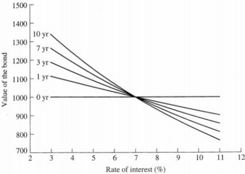 | 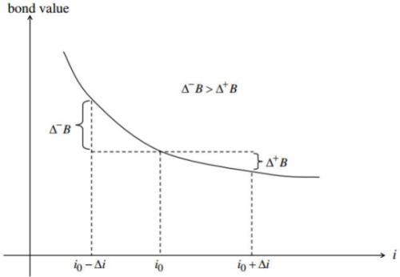 | 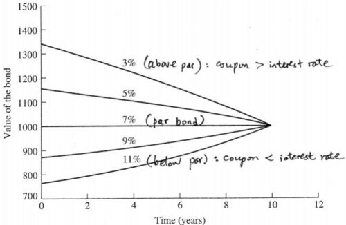 |

$\Zrm$

For bonds with *flat term structure*,
$$
\myBox{i = \frac{c}{B_t}+\frac{\Delta B_t}{B_t}}
$$
here $\dfrac{c}{B_t}$ is the **direct yield of the bond**

$\pf$
$$
\begin{align}
B_t &=\frac{c}{i}\SB{1-\frac{1}{\Pare{1+i}^{T-t}}}+\frac{B_T}{\Pare{1+i}^{T-t}}\\
&= \frac{c}{i}+\frac{1}{\Pare{1+i}^{T-t}}\Pare{B_T-\frac{c}{i}}\\
\implies B_t-\frac{c}{i} &= \frac{B_T-c/i}{\Pare{1+i}^T}\cdot\Pare{1+i}^t,\BBspace \myEmphy{\text{geometric series}}\\
\implies B_{t+1}&= \frac{c}{i}+\frac{1}{\Pare{1+i}^{T-t-1}}\Pare{B_T-\frac{c}{i}}\\
\implies B_{t+1}-B_t &= \frac{1}{\Pare{1+i}^{T-t-1}}\frac{i}{1+i}\Pare{B_T-\frac{c}{i}}\\
&= i\cdot \frac{1}{\Pare{1+i}^{T-t}}\Pare{B_T-\frac{c}{i}}\\
&= i\cdot\Pare{B_t-\frac{c}{i}}\\
&= iB_t - c\\
\implies \frac{\Delta B_t}{B_t} &= i-\frac{c}{B_t}
\end{align}
$$
$\QED$

$\eg{}$ $i=5\%$, $T=10$, $B_T=\$1000$, $c=\$70$, find the *proportional change* of bond value over the first one year

$\slu$
$$
\begin{align}
B_0 &= \frac{c}{i}+\frac{1}{\Pare{1+i}^{T-0}}\Pare{B_T-\frac{c}{i}}\\
&= \frac{\$70}{5\%}+\frac{1}{\Pare{1+5\%}^{10}}\Pare{\$1000-\frac{\$70}{5\%}} = 1154.44\\
\implies \frac{\Delta B_0}{B_0} &= i - \frac{c}{B_0} = 5\%-\frac{\$70}{\$1154.44} = -1.06\%
\end{align}
$$
$\Rmk$ Continuous case

Suppose the bond provides a continuous rate of coupon stream:

$\implies \myBox{\large{\tilde i_t = \dfrac{\tilde c_t}{B_t}+\dfrac{1}{B_t}\cdot\dfrac{\dd B_t}{\dd t}}}$

$\implies$ ODE: ${\dfrac{\dd B_t}{\dd t} = \tilde i_t B_t - \tilde c_t}$; terminal condition: at $t=T$, $B_t=B_T$

$\implies$ IF coupon rate $\tilde q=\tilde c_t/B_t<\tilde i_t$ $\implies \tilde i_t B_t - \tilde c_t = \dfrac{\dd B_t}{\dd t} > 0 \implies$ increasing $B_t$ 

---

$\Def$ Year to maturity

The YTM of a bond is the *internal rate of return* of the bond investment. This rate *<u>balance</u>* the cost to buy the bond (market price $B_0$) and the present value of all future gains, $i.e.$
$$
\myBox{B_0 = \frac{c}{1+i^*}+\frac{c}{\Pare{1+i^*}^2}+\cdots+\frac{c}{\Pare{1+i^*}^{T-1}}+\frac{c+B_T}{\Pare{1+i^*}^T}}\refs{2}
$$
$\Def$ Yield spread

the difference of the YTM of a bond and a Treasury with same maturity and par value

This is a **risk premium**

risk $\uparrow$, YTM $i^*\nearrow$, bond price $B_0\searrow$

$\Rmk$ With YTM in the denominator, apply the flat term structure, and convexity

## Duration measures and convexity

### Duration

$\Def$ Duration (discrete compounding)

The duration of a bond is the *weighted average* of the *times* when payments are made, with the weights applied to time $t$ being equal to *the ratio of the present value of the cash flow* at time $t$ to the *bond price*:

$i$: YTM

$$
\myBox{D = 1\cdot\frac{c/B_0}{1+i}+2\cdot\frac{c/B_0}{\Pare{1+i}^2}+\cdots+T\cdot\frac{\Pare{c+B_T}/B_0}{\Pare{1+i}^T}:=\sum_{t=1}^T t\cdot\Pare{\frac{c_t}{\Pare{1+i}^tB_0}} }
$$

Here $c_t$: cash flow at time $t$

$\Rmk$ the sum of all weights is $1$:

$i$: YTM

$\implies\eqref{2}$

$\implies$ 
$$
\myBox{\sum_{t=1}^T \frac{c_t}{\Pare{1+i}^tB_0} = \frac{\frac{c}{1+i^*}+\frac{c}{\Pare{1+i^*}^2}+\cdots+\frac{c}{\Pare{1+i^*}^{T-1}}+\frac{c+B_T}{\Pare{1+i^*}^T}}{B_0}=1}\refs{3}
$$
$\Rmk$

- *Duration is good measure of interest rate risk*
- Zero-coupon bond that last $n$ years has $D=n$, and if with coupon, $D<n$

$\Zrm$ Sensitivity

$\eqref{3} \implies \myBox{B_0 = \d{\sum_{t=1}^T \frac{c_t}{\Pare{1+i}^t}}}\implies$
$$
\begin{align}
\frac{\dd B_0}{\dd i} &= \sum_{t=1}^T -t\cdot\frac{c_t}{\Pare{1+i}^{t+1}} = -\frac{1}{1+i}\sum_{t=1}^T \frac{tc_t}{\Pare{1+i}^t}\\
\implies \frac{\dd B_0}{B_0} &= -\frac{1}{1+i}\sum_{t=1}^T \frac{tc_t}{\Pare{1+i}^tB_0} \dd i\\
&= -\frac{D}{1+i}\dd i
\end{align}
$$

$\Rmk$

$$
\myBox{\frac{\Delta B_0}{B_0}=i-\frac{c}{B_0}}\BBspace
\myBox{\frac{\dd B_0}{B_0} = -\frac{D}{1+i}\dd i}
$$

$\eg{}$ Suppose the bond is sold at par, $T=10$, $q=9\%$, find $D$

$\slu$

sold at par $\implies \text{YTM}=q=9\%\implies$
$$
\begin{align}
D &= \sum_{t=1}^T t\cdot\Pare{\frac{c_t}{\Pare{1+i}^t B_0}} = \sum_{t=1}^{9} t\cdot\Pare{\frac{0.09B_0}{1.09^t B_0}} + 10\cdot\frac{1.09B_0}{1.09^{10}B_0}\\
&= 6.9952
\end{align}
$$
$\slu$

using approximation:

$$
\begin{align}
D &= -\frac{1+i}{B_0}\frac{\dd B_0}{\dd i} = -\frac{1+i}{\dd i}\frac{\dd B_0}{B_0}\\
&\approx \space\myBox{ -\frac{1+i}{\Delta i} \frac{\Delta B_0}{B_0} }\\
\end{align}
$$

Suppose $\Delta i = 1\%$:

$\implies$

$$
\begin{align}
B_0\Pare{10\%} &= \frac{c}{i}\SB{1-\frac{1}{\Pare{1+i}^{T-t}}}+\frac{B_T}{\Pare{1+i}^{T-t}}\\
&= \frac{9}{10\%}\SB{1-\frac{1}{1.1^{10}}}+\frac{100}{1.1^{10}} = 93.855
\end{align}
$$

$\implies$

$$
\frac{\Delta B_0}{B_0} = \frac{93.855-100}{100} = -6.145\%\\
\implies D\approx -\frac{1+9\%}{1\%}\Pare{-6.145\%}=6.69805
$$

$\Rmk$

Or we can check how good is the approximation by using real $D$ to approximately find $\Delta B_0/B_0$:
$$
-6.145\% = \frac{\Delta B_0}{B_0} \approx \frac{\dd B_0}{B_0} = -\frac{D}{1+i}\dd i = -\frac{6.9952}{1.09}\times 1\%= -6.4176\%
$$

$\Def$ Modified duration
$$
\myBox{D_m = \frac{D}{1+i}}
$$
$\implies$
$$
\frac{\Delta B_0}{B_0} \approx \frac{\dd B_0}{B_0} = {\myEmphy-}D_m\dd i\\
\Var{\frac{\dd B_0}{B_0}} = D_m^2\Var{\dd i}
$$

IF $m$: compounding frequency per year $\implies$
$$
\myBox{D_m = \frac{D}{1+i/m}}
$$

$\implies \d{B_0=\sum_{k=1}^{mT} c_{\frac{k}{m}} \Pare{1+\frac{i}{m}}^{-k}}$

$\implies \d{\frac{\dd B_0}{\dd i} = \sum_{k=1}^{mT} -\frac{k}{m} \cdot c_{\frac{k}{m}} \Pare{1+\frac{i}{m}}^{-k-1}}$

$\implies\d{\frac{\dd B_0}{B_0} = \frac{-1}{1+i/m} \sum_{k=1}^{mT}\frac{k}{m}\cdot \frac{c_{\frac{k}{m}}}{\Pare{1+\frac{i}{m}}^k B_0}\dd i = -\frac{D}{1+i/m} \dd i = -D_m \dd i}  $

---

$\Zrm$ formula for duration
$$
\myBox{D = 1+\frac{1}{i}+\frac{T\Pare{i-c/B_T}-\Pare{1+i}}{c/B_T\SB{\Pare{1+i}^T-1}+i}} \refs{4}
$$
and thus $c/B_T \uparrow$, $D \searrow$

$\pf$

$\d{B_t = \frac{c}{i}\SB{1-\frac{1}{\Pare{1+i}^{T-t}}}+\frac{B_T}{\Pare{1+i}^{T-t}} \implies B_0 = \frac{c}{i}\SB{1-\frac{1}{\Pare{1+i}^T}}+\frac{B_T}{\Pare{1+i}^T} }\implies$

$$
\begin{align}
\frac{\dd B_0}{\dd i} &= c\Pare{-\frac{1}{i^2} + \frac{\Pare{1+i}^T+Ti\Pare{1+i}^{T-1}}{i^2\Pare{1+i}^{2T}}} - \frac{TB_T}{\Pare{1+i}^{T+1}}\\
&= \frac{c}{i}\SB{-\frac{1}{i}+\frac{1+i+Ti}{i\Pare{1+i}^{T+1}}}- \frac{TB_T}{\Pare{1+i}^{T+1}}
\end{align}
$$
$\implies$
$$
\begin{align}
D &= -\frac{1+i}{B_0}\frac{\dd B_0}{\dd i}\\
&= -\Pare{1+i}\cdot \frac{\frac{c}{i}\SB{-\frac{1}{i}+\frac{1+i+Ti}{i\Pare{1+i}^{T+1}}}- \frac{TB_T}{\Pare{1+i}^{T+1}}}{\frac{c}{i}\SB{1-\frac{1}{\Pare{1+i}^T}}+\frac{B_T}{\Pare{1+i}^T} }\\
&= \frac{\frac{c}{i}\cdot i\SB{\frac{1+i}{i}-\frac{1+i+Ti}{i\Pare{1+i}^T}}+ \frac{TB_T\cdot i}{\Pare{1+i}^T}}{c\SB{1-\frac{1}{\Pare{1+i}^T}}+\frac{iB_T}{\Pare{1+i}^T} }\\
&= 1+\frac{1}{i} + \frac{c\SB{\frac{-Ti}{i\Pare{1+i}^T}}+ \frac{iTB_T}{\Pare{1+i}^T} -\frac{iB_T}{\Pare{1+i}^T}\Pare{1+\frac{1}{i}}}{c\SB{1-\frac{1}{\Pare{1+i}^T}}+\frac{iB_T}{\Pare{1+i}^T} }\\
&= 1+\frac{1}{i} + \frac{c/B_T\Pare{-T}+iT-\Pare{1+i}}{c/B_T\SB{\Pare{1+i}^T-1} + i}\\
&= 1+\frac{1}{i} + \frac{T\Pare{i-c/B_T}-\Pare{1+i}}{c/B_T\SB{\Pare{1+i}^T-1} + i}
\end{align}
$$

$\pf$ preferred
$$
\begin{align}
B_0D &=1\cdot\frac{c}{1+i}+2\cdot\frac{c}{\Pare{1+i}^2}+\cdots+T\cdot\frac{c}{\Pare{1+i}^T}+T\cdot\frac{B_T}{\Pare{1+i}^T}\\
\Pare{1+i}B_0D &= c + 2\cdot\frac{c}{1+i}+3\cdot\frac{c}{\Pare{1+i}^2}+\cdots+T\cdot\frac{c}{\Pare{1+i}^{T-1}}+T\cdot\frac{B_T}{\Pare{1+i}^{T-1}}\\
iB_0D &=c + \frac{c}{1+i}+\frac{c}{\Pare{1+i}^2}+\cdots+\frac{c}{\Pare{1+i}^{T-1}}- T\cdot\frac{c}{\Pare{1+i}^T}+T\cdot\frac{iB_T}{\Pare{1+i}^T}\\
&= \frac{c\SB{1-\Pare{1+i}^{-T}}}{1-\Pare{1+i}^{-1}}+\frac{T\Pare{iB_T-c}}{\Pare{1+i}^T}
\end{align}
$$

$$
\begin{align}
D &= \frac{\d{\frac{c\SB{1-\Pare{1+i}^{-T}}}{1-\Pare{1+i}^{-1}}+\frac{T\Pare{iB_T-c}}{\Pare{1+i}^T}}}{\d{i\cdot\frac{c}{i}\SB{1-\frac{1}{\Pare{1+i}^T}}+i\cdot\frac{B_T}{\Pare{1+i}^T}}} = \frac{\d{\frac{c\SB{\Pare{1+i}^T-1}}{1-\Pare{1+i}^{-1}}+{T\Pare{iB_T-c}}}}{\d{c\SB{\Pare{1+i}^T-1}+iB_T}}\\
&= \frac{1}{1-\Pare{1+i}^{-1}} + \frac{\d{T\Pare{iB_T-c} - \frac{iB_T}{1-\Pare{1+i}^{-1}}}}{\d{c\SB{\Pare{1+i}^T-1}+iB_T}}\\
&= 1+\frac{1}{i} + \frac{\d{T\Pare{iB_T-c} - iB_T-B_T}}{\d{c\SB{\Pare{1+i}^T-1}+iB_T}} = 1+\frac{1}{i}+\frac{T\Pare{i-c/B_T}-\Pare{1+i}}{c/B_T\SB{\Pare{1+i}^T-1}+i}
\end{align}
$$

$\QED$

$\Rmk$ Generalization
$$
\myBox{D = \frac{1}{m}+\frac{1}{i}+\frac{T\Pare{i-c/B_T}-\Pare{1+\frac{i}{m}}}{c/B_T\SB{\Pare{1+\frac{i}{m}}^{mT}-1}+i}}
$$
$\pf$
$$
\begin{align}
B_0D &=\frac{1}{m}\cdot\frac{c/m}{1+\frac{i}{m}}+\frac{2}{m}\cdot\frac{c/m}{\Pare{1+\frac{i}{m}}^2}+\cdots+mT\cdot\frac{c/m}{\Pare{1+\frac{i}{m}}^{mT}} +mT\cdot\frac{B_T}{\Pare{1+\frac{i}{m}}^{mT}}\\
\implies \frac{i}{m}B_0D &=\frac{1}{m}\cdot\frac{\frac{c}{m}\SB{1-\Pare{1+\frac{i}{m}}^{-mT}}}{1-\Pare{1+\frac{i}{m}}^{-1}}+\frac{T\Pare{\frac{i}{m}B_T-c/m}}{\Pare{1+\frac{i}{m}}^{mT}}
\end{align}
$$

$$
\begin{align}
D &= \frac{\d{\frac{1}{m}\cdot\frac{\frac{c}{m}\SB{1-\Pare{1+\frac{i}{m}}^{-mT}}}{1-\Pare{1+\frac{i}{m}}^{-1}}+\frac{T\Pare{\frac{i}{m}B_T-c/m}}{\Pare{1+\frac{i}{m}}^{mT}}}}{\d{\frac{i}{m}\cdot\frac{c/m}{i/m}\SB{1-\frac{1}{\Pare{1+\frac{i}{m}}^{mT}}}+\frac{i}{m}\cdot\frac{B_T}{\Pare{1+\frac{i}{m}}^T}}} = \frac{\d{\frac{\frac{c}{m}\SB{\Pare{1+\frac{i}{m}}^{mT}-1}}{1-\Pare{1+\frac{i}{m}}^{-1}}+{T\Pare{iB_T-c}}}}{\d{c\SB{\Pare{1+\frac{i}{m}}^{mT}-1}+iB_T}}\\
&= \frac{1/m}{1-\Pare{1+\frac{i}{m}}^{-1}} + \frac{\d{T\Pare{iB_T-c} - \frac{iB_T}{1-\Pare{1+\frac{i}{m}}^{-1}}}}{c\SB{\Pare{1+\frac{i}{m}}^{mT}-1}+iB_T}\\
&= \frac{1}{m}+\frac{1}{i} + \frac{\d{T\Pare{iB_T-c} - \frac{i}{m}B_T-B_T}}{c\SB{\Pare{1+\frac{i}{m}}^{mT}-1}+iB_T} = \frac{1}{m}+\frac{1}{i} +\frac{T\Pare{i-c/B_T}-\Pare{1+i/m}}{c/B_T\SB{\Pare{1+i/m}^{mT}-1}+i}
\end{align}
$$

$\SUM$ Duration $D$
$$
\myBox{
\begin{align}
D &= 1\cdot\frac{c/B_0}{1+i}+2\cdot\frac{c/B_0}{\Pare{1+i}^2}+\cdots+T\cdot\frac{\Pare{c+B_T}/B_0}{\Pare{1+i}^T}:=\sum_{t=1}^T t\cdot\Pare{\frac{c_t}{\Pare{1+i}^tB_0}} \\
&= -\frac{1+i}{\dd i}\frac{\dd B_0}{B_0} \approx -\frac{1+i}{\Delta i} \frac{\Delta B_0}{B_0}\\
&= 1+\frac{1}{i}+\frac{T\Pare{i-c/B_T}-\Pare{1+i}}{c/B_T\SB{\Pare{1+i}^T-1}+i} \\
&= \frac{1}{m}+\frac{1}{i}+\frac{T\Pare{i-c/B_T}-\Pare{1+\frac{i}{m}}}{c/B_T\SB{\Pare{1+\frac{i}{m}}^{mT}-1}+i}
\end{align}
}
$$
and we have $\large{i\uparrow,B_T\downarrow,c/B_T \uparrow} \implies D \searrow$

### Relation between duration and maturity

$\Def$ Perpetual bond

bond with $T\to\infty$, and thus $D \to 1+\dfrac{1}{i}$; $B_0\to \dfrac{c}{i}$

From $\eqref{4}$, we see that

$\Corlr$

- about duration $D$ and maturity $T$
  - zero-coupon bonds: $D=T$
  - coupon-bearing bonds: $D \to 1+\dfrac{1}{i}$

- about coupon rate $c/B_T$ and YTM $i$
  - $c/B_T\geq i$ (bonds above par), $T\uparrow \implies D\nearrow\lim = 1+ \dfrac{1}{i} $
  - $c/B_T < i$ (bonds below par), $T\uparrow \implies D\nearrow\searrow\lim = 1+ \dfrac{1}{i} $, due to a change in the sign of the numerator $T\Pare{i-c/B_T}-\Pare{1+i}$ 

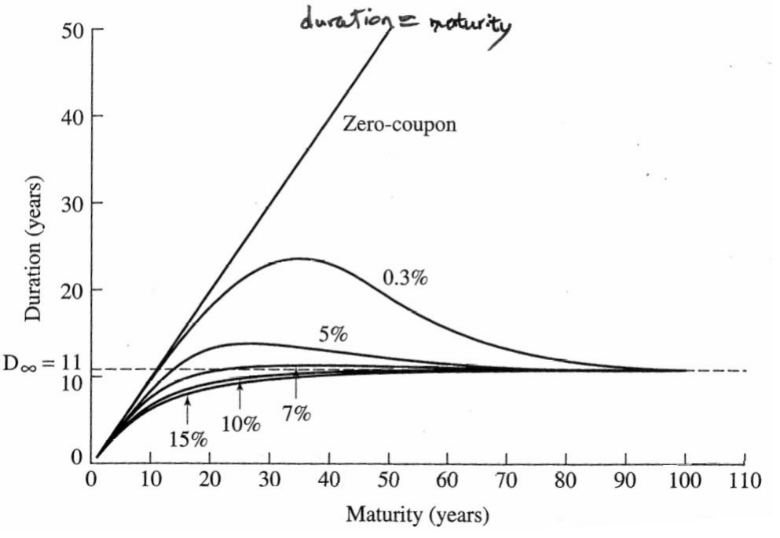

### Convexity

$\Def$ Convexity
$$
\myBox{C = \frac{1}{B_0}\frac{\dd^2 B_0}{\dd i^2} = \sum_{t=1}^{T}t\Pare{t+1}\SB{\frac{c_t}{\Pare{1+i}^{t+2}B_0}}}
$$

$\Zrm$ Quadratic approximation

**Taylor expansion** $\implies \myEmphy{\d{\Delta B_0 \approx \frac{\dd B_0}{\dd i}\Delta i + \frac{1}{2!}\frac{\dd^2 B_0}{\dd i^2}\Pare{\Delta i}^2}} \implies$
$$
\myBox{\frac{\Delta B_0}{B_0} \approx -\frac{D}{1+i}+\frac{1}{2!}C\Pare{\Delta i}^2}
$$

$\Rmk$

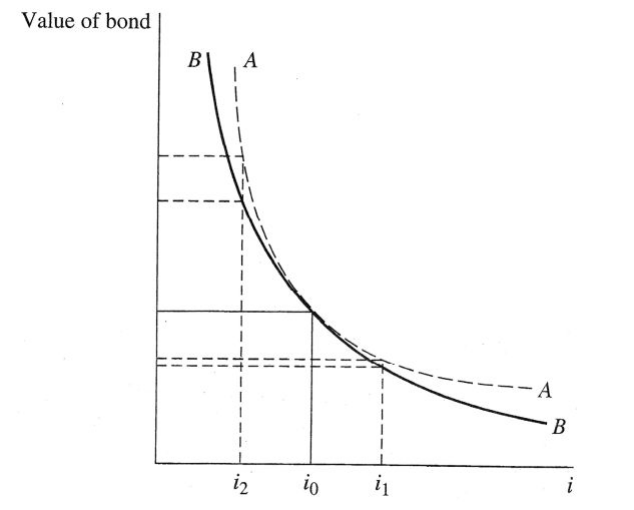

In the event of interest rates change

- $\Delta i <0$: bond $A$ gain more than $B$
- $\Delta i >0$: bond $A$ loss less than $B$

see ([Convexity](#Convexity-at-a-glance))

### Approximation

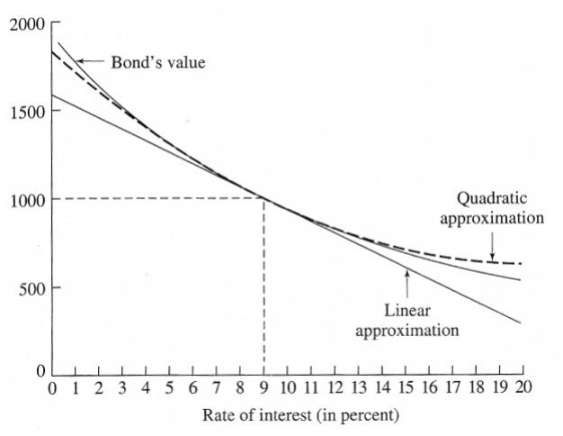

$\Zrm$

Linear approximation: $\myEmphy{\d{\frac{\Delta B_0}{B_0}\approx \frac{1}{B_0} \frac{\dd B_0}{\dd i} \Delta i = -D_m \Delta i}} \implies$
$$
\frac{B_0\Pare{i} -B_0\Pare{i_0}}{B_0\Pare{i_0}} = -D_m\Pare{i-i_0}\\
\implies \myBox{B_0\Pare{i} = B_0\Pare{i_0}\SB{-D_m i+\Pare{1+D_mi_0}}}
$$
Quadratic approximation: $\myEmphy{\d{\frac{\Delta B_0}{B_0}\approx \frac{1}{B_0} \frac{\dd B_0}{\dd i} \Delta i + \frac{1}{2!}\frac{1}{B_0}\frac{\dd^2B_0}{\dd i^2}\Pare{\Delta i}^2 = -D_m \Delta i +\frac{1}{2} C\Pare{\Delta i}^2}} \implies $
$$
\frac{B_0\Pare{i} -B_0\Pare{i_0}}{B_0\Pare{i_0}} = -D_m \Pare{i-i_0} +\frac{1}{2} C\Pare{i-i_0}^2 \\
\implies\myBox{B_0\Pare{i} = B_0\Pare{i_0}\SB{\frac{C}{2}i^2-\Pare{D_m+ci_0} i+\Pare{1+D_mi_0+\frac{C}{2}i_0^2}}}
$$

### Relation between duration and interest rate

$\Pops$

Let $w_t = \dfrac{c_t/B_0}{\Pare{1+i}^t}$, the ratio of the present value of the cash flow at time $t$ to the bond price, then
$$
\eqref{3}\implies \sum_{t=1}^T w_t=1, \Bspace D=\sum_{t=1}^T tw_t \implies\\
\myBox{\frac{\dd D}{\dd i} = -\frac{S}{1+i}=-\frac{1}{1+i}\sum_{t=1}^T w_t\Pare{t-D}^2}
$$
Here $S = \sum_{t=1}^T w_t\Pare{t-D}^2$, denotes the **dispersion** or *variance of the payment times of the bond*.

$\pf$
$$
\begin{align}
D &= \frac{1}{B_0\Pare i} \sum_{t=1}^T \frac{tc_t}{\Pare{1+i}^t} = -\frac{1+i}{\dd i}\frac{\dd B_0\Pare i}{B_0\Pare i}\implies\\
\frac{\dd D}{\dd i} &= \frac{1}{\SB{B_0\Pare{i}}^2}\sum_{t=1}^T\Pare{\frac{-t^2c_tB_0}{\Pare{1+i}^{t+1}}-\frac{tc_t B_0'\Pare{i}}{\Pare{1+i}^t}}\\
&= -\frac{1}{1+i}\sum_{t=1}^T\Pare{\frac{t^2c_t}{\Pare{1+i}^t B_0\Pare{i} }+\Pare{1+i}\frac{tc_t B_0'\Pare{i}}{\Pare{1+i}^t \SB{B_0\Pare{i}}^2}}\\
&= -\frac{1}{1+i}\CB{\SB{\sum_{t=1}^T\Pare{t^2\cdot\frac{c_t/B_0\Pare{i}}{\Pare{1+i}^t }}}-\SB{\Pare{-\Pare{1+i}\frac{B_0'\Pare{i}}{B_0\Pare{i}}}\cdot\sum_{t=1}^T\frac{tc_t}{\Pare{1+i}^tB_0\Pare{i}}}}\\
&= -\frac{1}{1+i}\SB{\Pare{\sum_{t=1}^Tt^2w_t}-D^2}
\end{align}
$$

$$
\begin{align}
\frac{\dd D}{\dd i} &= -\frac{1}{1+i}\SB{\Pare{\sum_{t=1}^Tt^2w_t}-D^2}\\
&= -\frac{1}{1+i}\Pare{\sum_{t=1}^T t^2w_t+ D^2\sum_{t=1}^T w_t - 2D\sum_{t=1}^Ttw_t}\\
&= -\frac{1}{1+i}\SB{\sum_{t=1}^T\Pare{ t^2w_t+ D^2w_t - 2 Dtw_t }}\\
&= -\frac{1}{1+i}\SB{\sum_{t=1}^Tw_t\Pare{t-D}^2}:=-\frac{S}{1+i}
\end{align}
$$

$\Rmk$

$\dfrac{\dd D}{\dd i} =-\dfrac{1}{1+i}\SB{\sum_{t=1}^Tw_t\Pare{t-D}^2}<0$, thus $i\uparrow \implies D\searrow$

### Relation between duration and convexity

$\Pops$
$$
\myBox{C = \frac{S+D\Pare{D+1}}{\Pare{1+i}^2}>0}
$$
$\pf$
$$
D = -\frac{1+i}{B_0\Pare{i}} \frac{\dd B_0}{\dd i} = -\frac{\Pare{1+i}B_0'}{B_0} \implies \frac{\dd D}{\dd i} = -\frac{\Pare{B_0'+\Pare{1+i}B_0''}B_0-\Pare{1+i}B_0'B_0'}{B_0^2}
$$

$$
\begin{align}
\implies -\frac{S}{1+i} &= -\frac{\Pare{B_0'+\Pare{1+i}B_0''}B_0-\Pare{1+i}B_0'B_0'}{B_0^2} \\
\frac{S}{1+i} &= \frac{\Pare{1+i}B_0''}{B_0} + \frac{B_0'}{B_0} - \frac{\Pare{1+i}B_0'B_0'}{B_0^2} \\
&= \frac{1+i}{B_0}B_0'' + \frac{B_0'}{B_0}\Pare{1 - \frac{\Pare{1+i}B_0'}{B_0}} \\
&= \frac{1+i}{B_0}B_0'' + \frac{B_0'}{B_0}\Pare{1+D}
\end{align}
$$

$$
\begin{align}
C &= \frac{1}{B_0}\frac{\dd^2 B_0}{\dd i^2}\\
\implies S &= \Pare{1+i}^2\frac{B_0''}{B_0}-\Pare{-\Pare{1+i}\frac{B_0'}{B_0}\Pare{1+D}}\\
&= \Pare{1+i}^2C-D\Pare{1+D}\\
\implies C &= \frac{S+D\Pare{D+1}}{\Pare{1+i}^2}
\end{align}
$$

### Fisher-Weil's duration

$\Def$ **Fisher-Weil's duration** 

Duration with weights of the times of payment make use of the spot rates pertaining to each term:
$$
D_{\text{fw}} = \sum_{t=1}^T \Pare{t\cdot\frac{c_t}{\SB{1+i\Pare{0,t}}^tB_0}}
$$
$\Rmk$

with $i$ being $\text{YTM}$, we have the regular $D$:
$$
D =\sum_{t=1}^T \Pare{t\cdot\frac{c_t}{\Pare{1+i}^tB_0}}
$$

### More about continuous compounding

$\Lm$

$i\Pare z$: instantaneous forward rate

$\implies$ growth factor over $\SB{z,z+\dd z}$: $e^{i\Pare z \dd z}$

$\implies$ through time $t$: $\exp\CB{\int_0^t i\Pare z\;\dd z}=\exp\CB{i\Pare{0,t}\cdot t} \implies$
$$
\myBox{i\Pare{0,t} = \frac{1}{t}\int_0^t i\Pare z\;\dd z}
$$

meaning that:

spot rate $i\Pare{0, t}$ is the *average* of all *implicit forward rates*.

$\Lm$
$$
\begin{align}
i\Pare{0,t}+\alpha &= \frac{t\alpha + \int_0^t i\Pare z\,\dd z}{t}\\
&= \frac{\int_0^t \alpha\,\dd z + \int_0^t i\Pare z\,\dd z}{t}\\
&= \frac{1}{t}\int_0^t\Pare{i\Pare{z}+\alpha}\;\dd z
\end{align}
$$
increasing $i\Pare{0, t}$ by $\alpha$ is equivalent to displacing **implicit forward rates structure** $i\Pare z$ vertically by $\alpha$

$\Zrm$
$$
\myBox{B_0\Pare{\IsI} = \int_0^T c_t e^{-i\Pare{0,t}t}\;\dd t}
$$

Here $B_0\Pare{\IsI}$ is a functional, and $\IsI$ is a function (term structure of interest rates)
$$
\myBox{D\Pare{\IsI} = \frac{1}{B_0\Pare{\IsI}}\int_0^T tc_t e^{-i\Pare{0,t}t}\;\dd t}
$$
and we have
$$
\begin{align}
\frac{\Delta B_0\Pare\IsI}{B_0\Pare\IsI} &= \frac{B_0\Pare{\IsI+\Delta \alpha}-B_0\Pare\IsI}{B_0\Pare\IsI} \\
&= \frac{1}{B_0\Pare\IsI}\Pare{\int_0^T c_t e^{-\Pare{i\Pare{0,t}+\Delta \alpha}t}\;\dd t - \int_0^T c_t e^{-i\Pare{0,t}t}\;;\dd t}\\
&= \frac{1}{B_0\Pare\IsI}\int_0^T c_te^{-i\Pare{0,t}t}\Pare{e^{-t\Delta\alpha}-1}\;\dd t \\
&\approx \frac{1}{B_0\Pare\IsI}\int_0^T c_te^{-i\Pare{0,t}t}\Pare{-t\Delta\alpha}\;\dd t \\
&= \frac{-\Delta \alpha}{B_0\Pare\IsI}\int_0^T tc_te^{-i\Pare{0,t}t}\;\dd t \\
&= -D\Pare\IsI\Delta \alpha\\
\end{align}
$$

$$
\implies \myBox{\frac{\dd B_0}{B_0} = -D\Pare{\IsI}\dd i }
$$

$\Rmk$

in the discrete case, $\dfrac{\dd B_0}{B_0} = -D_m\dd i$, the duration is modified since we need to multiply the discount factor $1/\Pare{1+i}$ over one year

## Horizon rate of return

$\Def$ **horizon rate of return**

$H$: time horizon

$B_0$: bond price

$F_H$: future value

$\implies$ horizon rate of return: $r_H = \Pare{\dfrac{F_H}{B_0}}^{1/H}-1$

$\Rmk$

$B_0$: money you invest

$F_H$: money you gain

$\implies r_H$: **overall rate of return**

$\Zrm$ limit of $r_H$

$i_0$: flat rate, interest rate

$B_0\Pare{i_0}$: bond price

later the rate shift to $i$

$B_0\Pare i$: bond price at interest rate $i$

$F_H = \Pare{1+i}^HB_0\Pare{i} \implies$
$$
\myBox{r_H = \Pare{\frac{B_0\Pare{i}}{B_0\Pare{i_0}}}^{1/H}\Pare{1+i}-1}
$$

and $i=i_0\implies r_H=i_0$

and $H\to\infty \implies r_H\to 1\cdot \Pare{1+i}-1=i$

$\Rmk$

$B_0\Pare i$ is decreasing, and $1+i$ is increasing $\implies$

a *counterbalance* between

- immediate capital gain/loss (from bond)
- and rate of return on the cash flow from now till $H$

$\eg{}$ Calculation of $r_H$

$T=10$

$q=7\%$

$i_0=5\%$

$B\Pare{i_0}=\$1154.44$

$D=7.7$

Suppose in the next day, $i=6\%$, and will keep for the following years

$B\Pare{i}=\$1073.60$

Suppose bonds holding time $H=5$

$\implies$
$$
r_H = \Pare{\frac{\$1073.60}{\$1154.44}}^{1/5}\Pare{1+6\%}-1=4.47\%
$$

|                Table of figure                 |                      plot                      |
| :--------------------------------------------: | :--------------------------------------------: |
| 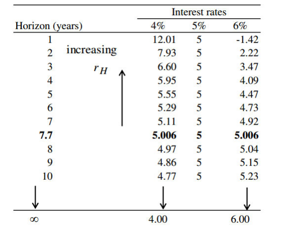 | 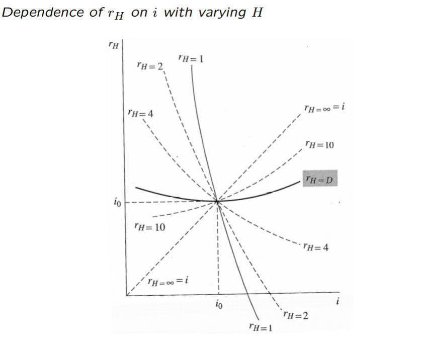 |

through this example, we run into this theorem

$\Zrm$

There exists a horizon $H$ such that the rate of return for such a horizon, $r_H$ goes through a *minimum* at point $i_0$

$\pf$

minimizing $r_H\iff$ minimizing $F_H$ $\implies$

<u>First order</u>
$$
\frac{\dd F_H}{\dd i} = \frac{\dd }{\dd i}\SB{B_0\Pare{i}\Pare{1+i}^H}=B_0'\Pare{i}\Pare{1+i}^H+HB_0\Pare i\Pare{1+i}^{H-1}=0
$$
this hold at $i=i_0 \implies$
$$
\begin{align}
0 &= B_0'\Pare{i_0}\Pare{1+i_0}^H+HB_0\Pare{i_0}\Pare{1+i_0}^{H-1}\\
&= B_0'\Pare{i_0}\Pare{1+i_0} + HB_0\Pare{i_0}\\
\end{align}\\
\implies \myBox{H = -\frac{1+i_0}{B_0\Pare{i_0}}B_0'\Pare{i_0} = D}
$$
$\implies$ at the initial rate of return $i_0$, $H=D$

<u>Second order</u>: $\myEmphy{\dfrac{\dd^2}{\dd i^2}\Pare{\ln F_H}}$
$$
\frac{\dd}{\dd i}\Pare{\ln F_H}=\frac{\dd \ln\Pare{B_0}}{\dd i}+\frac{H}{1+i} = \myEmphy{\frac{1}{B_0}B_0'} + \frac{H}{1+i} = -\frac{-D+H}{1+i}
$$

$$
\implies\frac{\dd^2}{\dd i^2}\Pare{\ln F_H} = \frac{-D'\Pare{1+i}+D-H}{\Pare{1+i}^2}
$$

$i=i_0\implies $
$$
\given{\frac{\dd^2}{\dd i^2}\Pare{\ln F_H}}_{i=i_0} = \frac{-D'\Pare{i_0}\Pare{1+i_0}+D\Pare{i_0}-H}{\Pare{1+i_0}^2} = -\frac{D'\Pare{i_0}}{1+i_0}
$$
$\myEmphy{\dfrac{\dd D}{\dd i} = -\dfrac{S}{1+i}} \implies$
$$
\myBox{\given{\frac{\dd^2}{\dd i^2}\Pare{\ln F_H}}_{i=i_0} = \frac{S}{1+i_0}>0} \implies
$$
$F_H$ and $r_H$ would reach a global minimum at point $i = i_0$, whenever $H=D\Pare{i_0}$

$\QED$

$\Lm$ **dispersion** in continuous case

$\d{w\Pare t := \frac{c_t \exp\CB{-\SB{i_0\Pare{0,t}+\alpha}t}}{B_0\Pare{\IsI_0+\alpha}} \implies \int_0^T w\Pare{t}\;\dd t=1 \implies}$
$$
\myBox{\frac{\dd D\Pare{\IsI_0+\alpha}}{\dd \alpha}=-S\Pare{\IsI_0+\alpha}=-\int_0^T w\Pare t \SB{t-D\Pare{\IsI_0+\alpha}}^2\;\dd t}
$$
$S\Pare{\IsI_0+\alpha}$: **dispersion** or *variance* of the payment times of the bond

$\pf$
$$
\begin{align}
\frac{\dd D\Pare{\IsI_0+\alpha}}{\dd \alpha} &= \frac{\dd }{\dd \alpha} \Pare{\frac{1}{B_0\Pare{\IsI_0+\alpha}} \int_0^T tc_t \exp\CB{-t\SB{i_0\Pare{0,t}+\alpha}}\;\dd t }\\
&= \frac{1}{\SB{B_0\Pare{\IsI_0+\alpha}}^2} \Bigg[ B_0\Pare{\IsI_0+\alpha}\cdot\int_0^T -t^2c_t \exp\CB{-t\SB{i_0\Pare{0,t}+\alpha}}\;\dd t\\
&\BBspace-B_0'\Pare{\IsI_0+\alpha}\cdot\int_0^T tc_t \exp\CB{-t\SB{i_0\Pare{0,t}+\alpha}}\;\dd t \Bigg] \\
&= -\Bigg[ \frac{1}{B_0\Pare{\IsI_0+\alpha}} \int_0^T t^2c_t \exp\CB{-t\SB{i_0\Pare{0,t}+\alpha}}\;\dd t\\
&\BBspace + \Pare{\frac{1}{B_0\Pare{\IsI_0+\alpha}} \int_0^T tc_t \exp\CB{-t\SB{i_0\Pare{0,t}+\alpha}}\;\dd t}\cdot\frac{B_0'\Pare{\IsI_0+\alpha}}{B_0\Pare{\IsI_0+\alpha}} \Bigg]\\
&= -\SB{\Pare{\int_0^T t^2w\Pare{t}\;\dd t}-D^2\Pare{\IsI_0+\alpha}}\\
&= -\int_0^T w\Pare t \SB{t-D\Pare{\IsI_0+\alpha}}^2\;\dd t
\end{align}
$$
$\QED$

$\Zrm$ global minimum in continuous case

There exists a horizon $H$ such that the rate of return for such a horizon, $r_H$ goes through a *minimum* at point $i_0$, when $i$ changes continuously

$\pf$ continuous case

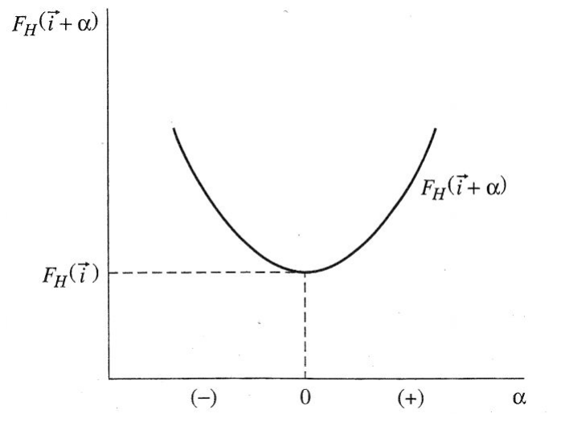

<u>First order</u>

$\d{ \myEmphy{ F_H \Pare{\IsI_0} = B_0 \Pare{\IsI_0} \exp\CB{ i_0 \Pare{0,H} \cdot H} } \implies F_H\Pare{\IsI_0+\alpha} = B_0 \Pare{\IsI_0+\alpha}\exp\CB{\SB{i_0\Pare{0,H}+\alpha}H } \implies}$
$$
\myBox{F_H \Pare{\IsI} = B_0 \Pare{\IsI} \exp\CB{ i \Pare{0,H} \cdot H}}
$$
$\implies$ to reach a minimum we need
$$
\begin{align}
\given{\frac{\dd }{\dd \alpha} \ln F_H\Pare{\IsI_0+\alpha}}_{\alpha=0} &= \given{\frac{\dd }{\dd \alpha} \ln B_0\Pare{\IsI_0+\alpha}}_{\alpha=0}+\frac{\dd}{\dd \alpha}\SB{H\Pare{i_0+\alpha}}\\
&= \given{\frac{1}{B_0\Pare{\IsI_0+\alpha}}\cdot\frac{\dd B_0\Pare{\IsI_0+\alpha}}{\dd \alpha} }_{\alpha=0}+ H\\
&= -D\Pare{\IsI_0}+H=0
\end{align}\\
\implies\myBox{H=D\Pare{\IsI_0}}
$$
$\Rmk$ or just apply the same method like before, fine $\dfrac{\dd}{\dd\alpha}F_H$

<u>Second order</u>

$\d{\myEmphy{\frac{\dd^2}{\dd\alpha^2}\ln F_H =\frac{\dd}{\dd\alpha}\Pare{\frac{1}{B_0\Pare{\IsI_0+\alpha}}\cdot\frac{\dd B_0\Pare{\IsI_0+\alpha}}{\dd \alpha} } = \frac{\dd}{\dd\alpha}\Pare{-D\Pare{\IsI+\alpha}}}}$

$\Lm \implies$
$$
\frac{\dd^2}{\dd\alpha^2}\ln F_H\Pare{\IsI_0+\alpha}=S\Pare{\IsI+\alpha}>0
$$
$\implies \ln F_H$ go through a global minimum at point $\alpha=0$

$\QED$

## Immunization of bond investment

$\Def$ in portfolio term

$V_j$: value of $j$th asset$\implies$

asset duration: $D_j = -\dfrac{1}{V_j}\dfrac{\dd V_j}{\dd i}$

$P=\sum V_j$: value of portfolio$\implies$ 

portfolio duration: $D = -\dfrac{1}{P}\dfrac{\dd P}{\dd i}$

$\implies$
$$
D = -\frac{1}{P}\frac{\dd P}{\dd i}=-\frac{1}{P}\sum\frac{\dd V_j}{\dd i} = \myBox{\sum_{j=1}^n \frac{V_j}{P}D_j = D}
$$
$D$ is the *weighted average* of $D_j$ with weight being equal to the ratio of the value of each asset of that of the portfolio

$\implies$
$$
\myBox{C = \frac{1}{P}\frac{\dd^2 P}{\dd i^2}=\sum_{j=1}^n\frac{V_j}{P}C_j}
$$
Similarly, $C$ is the *weighted average* of $C_j$ with weight blah

$\Def$ **Immunization**

Immunization is the set of bond management procedures that aim at protecting the investor against changes in interest rates, such that its **duration** is kept *equal* to his **horizon** *dynamically*

- when the horizon is the duration of the bond, $r_H$ will be about the same even $i$ changes a little
- dynamic
  - changes in $i$ $\implies$ changes in $D$
  - time pass $\implies$ duration drops
- other methods
  - cash flow mathcing
  - duration matching (with $H$)
  - convexity matching

$\Rmk$

Immunization is also a strategy that matches the durations of assets and **liabilities**, thereby minimizing the impact of interest rates on the **net worth**.

Analogous to option, $D$ is delta, $C$ is gamma

$\eg{}$ Immunization process

obligation: pay $\$1$ million in $10$ years

semi-annually compounded

possible bond
$$
\begin{array}{cccccc}\hline
 & \text{coupon rate} &\text{maturity} &\text{price} &\text{yield} &\text{duration}\\\hline
 \text{bond 1} & \text{6%} & \text{30 yr} & 69.04  & \text{9%} & 11.44\\
 \text{bond 2} & \text{11%}  & \text{10 yr} & 113.01  & \text{9%} & 6.54\\
 \text{bond 3} & \text{9%} & \text{20 yr} & 100.00  & \text{9%} & 9.61\\\hline
\end{array}
$$
$\slu$

Present value of obligation:
$$
\text{PV}=B_0 = \frac{B_T}{\Pare{1+i/2}^{2T}}=\frac{10^6}{1.045^{20}}=414642.86
$$
$10>6.54,10>9.61 \implies$ suppose we use bond 1 and bond 2 to immunize the risk $\implies$
$$
\begin{cases}
V_1+V_2 = \text{PV}=\$414642.86\\
\d{D_1\frac{V_1}{\text{PV}} + D_2\frac{V_2}{\text{PV}} =10}
\end{cases}\\
\implies \begin{cases}
V_1 = \$292, 788.632\\
V_1 = \$121, 854.228\\
\end{cases}\implies \text{shares: }\begin{cases}
S_1=292, 788.63/69.04\approx4241\\
S_2=121, 854.23/113.01\approx1078\\
\end{cases}
$$
$\Rmk$ Check how this gonna work

Suppose $\Delta i=-1\%$, $\myEmphy{\d{B_0=\frac{c}{i}\Pare{1-\frac{1}{\Pare{1+i}^T}}+\frac{B_T}{\Pare{1+i}^T}}} \implies$
$$
\begin{align}
\text{bond 1: }&B_0\Pare{8\%}=\frac{6}{8\%}\times\Pare{1-\frac{1}{1.04^{60}}}+\frac{100}{1.04^{60}}=77.3765\\
\text{bond 2: }&B_0\Pare{8\%}=\frac{11}{8\%}\times\Pare{1-\frac{1}{1.04^{20}}}+\frac{100}{1.04^{20}}=120.3855
\end{align}
$$

$$
\text{PV}=B_0 = \frac{B_T}{\Pare{1+i/2}^{2T}}=\frac{10^6}{1.04^{20}}=456386.946
$$

$\implies$
$$
\begin{array}{cc}\hline
&\begin{array}{ccc}&\text{interest rate}&\\ \hline
\bspace\small{9.0\%}\bspace & \small8.0\% & \bspace\small10.0\%\bspace
\end{array}
\\ \hline

\begin{array}{l}
\begin{array}{cc}
\text{bond 1}&\begin{array}{c}
\text{Price}\\
\text{Shares}\\
\text{Value}
\end{array}\\[0.7em]
\text{bond 2}&\begin{array}{c}
\text{Price}\\
\text{Shares}\\
\text{Value}
\end{array}
\end{array}\\
\text{Obligation}\\
\text{Surplus}
\end{array} & \begin{array}{ccc}
69.04 & 77.38 & 62.14 \\
4241 & 4241 & 4241 \\
292798.64 & 328168.58 & 263535.74\\[0.7em]
113.01 & 120.39  & 62.14 \\
1078 & 1078 & 1078 \\
121824.78&129780.42 & 263535.74\\
414642.86 & 456386.946 & 376889.48\\
-19.44 & 1562.05\uparrow & 1162.20\uparrow
\end{array}
\\\hline
\end{array}
$$
$\Rmk$

- either interest rate rise or shrink, surplus increase
- *DO NOT* use approximation ($\myEmphy{\dfrac{\Delta B_0}{B_0} \approx -\dfrac{D}{1+i}\Delta i}$) to calculate the bond price, which would lead to a huge error!

### Asset and liabilities management

$\Zrm​$ Redington conditions

Suppose flat term structure, $i$

liabilities: $L_t$, $t=1,\dots,T$

assets: $A_t$, $t=1,\dots,T$

$\implies \d{L=\sum \frac{L_t}{\Pare{1+i}^t}}$, $\d{A=\sum \frac{A_t}{\Pare{1+i}^t}}$

$\implies \d{D_L=\sum t \frac{L_t}{L\Pare{1+i}^t}}$, $\d{D_A=\sum t \frac{A_t}{A\Pare{1+i}^t}}$

Net value: $N=A-L$

Suppose initially, $N=0$,
$$
\implies\myBox{\frac{\dd N}{\dd i}=\frac{A}{1+i}\Pare{D_L-D_A}=0}\BBspace\myBox{\frac{\dd^2 A}{\dd i^2}>\frac{\dd^2 L}{\dd i^2}}
$$
$\pf$

<u>First order condition (first Redington property)</u>: $N$ should be insensitive to $i$
$$
\begin{align}
\frac{\dd N}{\dd i} &= \frac{\dd}{\dd i}\Pare{\sum \frac{A_t-L_t}{\Pare{1+i}^t}}\\
&= \sum -t\frac{A_t-L_t}{\Pare{1+i}^{t+1}}=\frac{1}{1+i}\Pare{D_L\cdot L-D_A\cdot A}
\end{align}
$$
$D=A \implies \d{\frac{\dd N}{\dd i} =\frac{A}{1+i}\Pare{D_L-D_A}=0}$

<u>Second order condition</u>: within an interval of $i_0$, $N$ remains positive

$\implies N\Pare i$ is at least *convex* within the interval

$\implies \dfrac{\dd^2 A}{\dd i^2} -\dfrac{\dd^2 L}{\dd i^2}>0$

Dispersion $S \uparrow$, $C\uparrow \implies$ *the dispersion* ($S$) *of the inflows should be larger than that of the outflows*

$\QED$

$\eg{}$ Numerical example

- investing $\$1$ million in a $20$-year coupon bond with an $8.5\%$ interest rate, $8.5\%$ coupon rate
- financed with a $9$-year $\$1$ million loan carrying an $8\%$ interest rate, $8\%$ coupon rate

$m=2$, semi-annual compounding

$\slu$
$$
D_A=D_1=\frac{1}{2}+\frac{1}{0.085}+\frac{20\Pare{0.085-0.085}-\Pare{1+0.0425}}{0.085\SB{\Pare{1+0.0425}^{40}-1}+0.085}=9.944
$$
similarly, $D_L=6.583 \implies$
$$
D_{mA}=\frac{D_A}{1+\frac{i_A}{2}}=9.539,\BBspace D_{mL}=\frac{D_L}{1+\frac{i_L}{2}}=6.330
$$
$\implies$
$$
\frac{\Delta V_N}{V_A}=\frac{\Delta V_A-\Delta V_L}{V_A} \approx \frac{\dd V_A}{V_A}-\frac{\dd V_L}{V_L}=-D_{mA}\dd i_A+D_{mL}\dd i_L=-3.209\dd i
$$

### Cash matching

Suppose

a sequence of future monetary obligations: $\mathbf y=\Pare{y_1,\dots,y_n}$

totally $m$ bonds

cash stream associated for bond $j$: $\mathbf{c}_j=\Pare{c_{j1},\dots,c_{jn}}$

price of bond $j$: $p_j$

units of bond $j$ held: $x_j$

Aim: to minimize $\sum p_j x_j$

subject to: $\begin{cases}\d{\sum_{j=0}^m c_{ji}x_j\geq y_i}, & i=1,2,\dots,n\\ \d{x_j\geq 0}, & j=1,2,\dots,m\end{cases}$

For example:

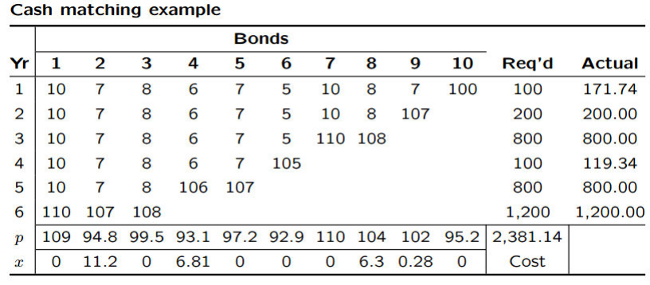

we would buy $11.2$ units of bond 2, $6.81$ units of bound 4, $6.3$ units of bond 7, and $0.28$ units of bond 9

