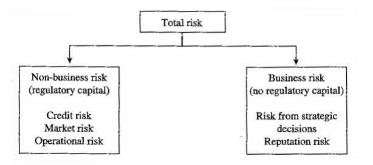
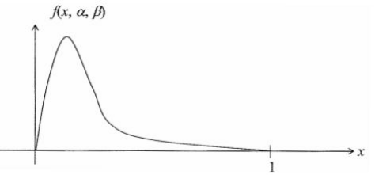
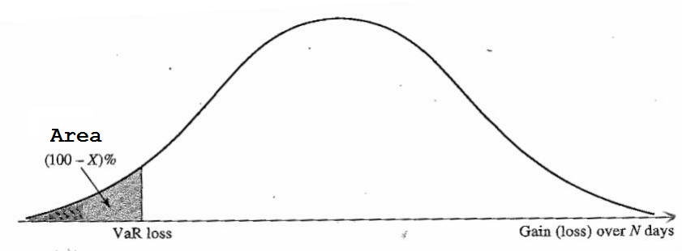
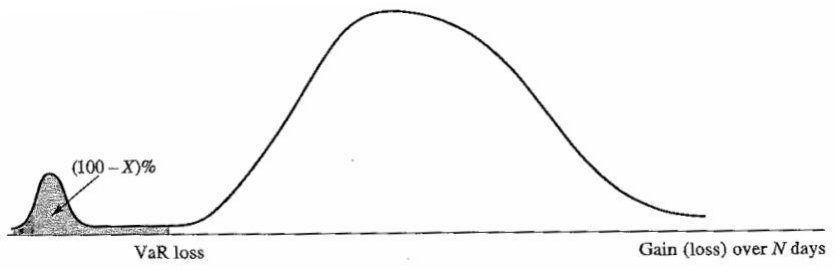
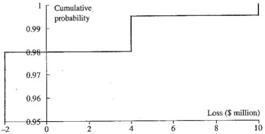

# Quantitative Methods for Risk Management

$$
% bbox
% \bbox[#EEF, 5px, border: 2px solid #880015]{E=mc^2}
% \bbox[9px, border:2px solid #880015]{abc}
% text size
% tiny scriptsize small normalsize large Large LARGE huge Huge
% color
% aquamarine, black, blue, brown, cyan, darkgray, gray, green, lightgray, lime, magenta, olive, orange, pink, purple, red, teal, violet, white, yellow
\DeclareMathOperator*{\argmin}{argmin}
\DeclareMathOperator*{\argmax}{argmax}
\DeclareMathOperator*{\plim}{plim}
\DeclareMathOperator*{\span}{span}
\newcommand{\space}{\;\;}
\newcommand{\bspace}{\;\;\;}
\newcommand{\Bspace}{\;\;\;\;}
\newcommand{\bbspace}{\;\;\;\;\;}
\newcommand{\BBspace}{\;\;\;\;\;\;}
\newcommand{\QQQ}{\boxed{?\:}}
\newcommand{\void}{\left.\right.}
% \newcommand{\myEmphy}[2][#880015]{\color{#1}{#2}}
% \newcommand{\myEmphyQ}{\color{#880015}}
% \newcommand{\myBox}[2][9px, border:2px solid #880015]{\bbox[#1]{#2}}
% \newcommand{\myBoxQ}{\bbox[9px, border:2px solid #880015]}
\newcommand{\myEmphy}[2][#880015]{ {\color{#1}{#2}} }
\newcommand{\myBox}[2][9px, border:2px solid #880015]{ {\bbox[#1]{#2}} }
\newcommand{\d}[1]{ {\displaystyle{#1}} }
\newcommand{\Tran}[1]{{#1}^{\mathrm{T}}}
\newcommand{\CB}[1]{\left\{ #1 \right\}}
\newcommand{\SB}[1]{\left[ #1 \right]}
\newcommand{\Pare}[1]{\left( #1 \right)}
\newcommand{\abs}[1]{\left| #1 \right|}
\newcommand{\norm}[1]{\left\| #1 \right\|}
\newcommand{\given}[1]{\left. #1 \right|}
\newcommand{\using}[2][=]{\overset{\mathrm{#2}}{#1}}
\newcommand{\usingUD}[3][=]{\underset{\text{#2}}{\overset{\text{#3}}{#1}}}
\newcommand{\tinyText}[1]{ {\tiny{\text{#1}}} }
\newcommand{\scriptsizeText}[1]{ {\scriptsize{\text{#1}}} }
\newcommand{\footnotesizeText}[1]{ {\footnotesize{\text{#1}}} }
\newcommand{\smallText}[1]{ {\small{\text{#1}}} }
\newcommand{\largeText}[1]{ {\large{\text{#1}}} }
\newcommand{\LargeText}[1]{ {\Large{\text{#1}}} }
\newcommand{\LARGEText}[1]{ {\LARGE{\text{#1}}} }
\newcommand{\hugeText}[1]{ {\huge{\text{#1}}} }
\newcommand{\HugeText}[1]{ {\Huge{\text{#1}}} }
\newcommand{\RR}{\mathbb{R}}
\newcommand{\EE}{\mathbb{E}}
\newcommand{\FF}{\mathbb{F}}
\newcommand{\II}{\mathbb{I}}
\newcommand{\NN}{\mathbb{N}}
\newcommand{\ZZ}{\mathbb{Z}}
\newcommand{\QQ}{\mathbb{Q}}
\newcommand{\PP}{\mathbb{P}}
\newcommand{\AcA}{\mathcal{A}}
\newcommand{\CcC}{\mathcal{C}}
\newcommand{\FcF}{\mathcal{F}}
\newcommand{\IcI}{\mathcal{I}}
\newcommand{\NcN}{\mathcal{N}}
\newcommand{\AsA}{\mathscr{A}}
\newcommand{\FsF}{\mathscr{F}}
\newcommand{\IsI}{\mathscr{I}}
\newcommand{\dd}{\mathrm{d}}
\newcommand{\asim}{\overset{\text{a}}{\sim}}
\newcommand{\idctV}{\mathbf{1}}
\newcommand{\refs}[1]{ \tag{#1}\label{#1} }
\newcommand{\I}[1]{\mathrm{I}\left( #1 \right)}
\newcommand{\N}[1]{\mathcal{N}\left( #1 \right)}
\newcommand{\Exp}[1]{\mathrm{E}\left[ #1 \right]}
\newcommand{\Var}[1]{\mathrm{Var}\left[ #1 \right]}
\newcommand{\Avar}[1]{\mathrm{Avar}\left[ #1 \right]}
\newcommand{\Cov}[1]{\mathrm{Cov}\left( #1 \right)}
\newcommand{\Corr}[1]{\mathrm{Corr}\left( #1 \right)}
\newcommand{\ExpH}{\mathrm{E}}
\newcommand{\VarH}{\mathrm{Var}}
\newcommand{\AVarH}{\mathrm{Avar}}
\newcommand{\CovH}{\mathrm{Cov}}
\newcommand{\CorrH}{\mathrm{Corr}}
\newcommand{\ow}{\text{otherwise}}
\newcommand{\wp}{\text{with probability }}
\newcommand{\VaR}{\text{VaR}}
\newcommand{\FSD}{\text{FSD}}
\newcommand{\SSD}{\text{SSD}}
\newcommand{\QED}{\myEmphy{\blacksquare}}
\newcommand{\SUM}{\myEmphy{\text{Summary}}}
\newcommand{\pf}{\myEmphy{\largeText{Proof}}}
\newcommand{\slu}{\myEmphy{\largeText{Solution}}}
\newcommand{\Corlr}{\myEmphy{\largeText{Corrollary}}}
\newcommand{\Rmk}{\myEmphy{\largeText{Remark}}}
\newcommand{\pops}[1]{\myEmphy{\largeText{Proposition #1}}}
\newcommand{\Pops}{\myEmphy{\largeText{Proposition}}}
\newcommand{\zrm}[1]{\myEmphy{\largeText{Theorem #1}}}
\newcommand{\Zrm}{\myEmphy{\largeText{Theorem}}}
\newcommand{\ppt}[1]{\myEmphy{\largeText{Property #1}}}
\newcommand{\Ppt}{\myEmphy{\largeText{Property}}}
\newcommand{\def}[1]{\myEmphy{\largeText{Definition #1}}}
\newcommand{\Def}{\myEmphy{\largeText{Definition}}}
\newcommand{\lm}[1]{\myEmphy{\largeText{Lemma #1}}}
\newcommand{\Lm}{\myEmphy{\largeText{Lemma}}}
\newcommand{\eg}[1]{\myEmphy{\largeText{Example #1}}}
\newcommand{\ex}[1]{\myEmphy{\largeText{Exercise.#1}}}
\newcommand{\rmk}[1]{\myEmphy{\largeText{Remark #1}}}
\myEmphy{\smallText{Xavier}}
$$

## Types of financial risks and loss distributions

$\Def$ Risk

- loss or exposure to mischance
- volatility of unexpected outcomes

**Risk management** is the process by which various risk exposures are identified, measured, and controlled.

### Market risk

due to the volatility of market price

- Absolute risk, measured in dollar terms
- Relative risk, measured relative to a benchmark index

$\Def$ Directional risk

 due to the direction of movements in financial variables

- **Duration**, with interest rate
- **Delta**, with underlying asset price

$\Def$ Non-directional risks

due to Non-linear exposures and exposures to hedged positions or to volatilities

- **Convexity**, with interest rate
- **Gamma**, with underlying asset price
- **Volatility risk**, due to actual or implied volatility
- **Basis risk**: when offsetting investments in a hedging strategy do not experience price changes in entirely opposite directions from each other. For example: The *imperfect correlation* between the two investments creates the potential for excess gains or losses in a hedging strategy

### Credit risk

- quantified by the (yield) spread, which is the yield above the risk-free Treasury rate (while higher risk, higher YTM, lower bond price)

$\Def$ **Default risk**

any non-compliance with the exact specification of a contract

- **Arrival risk**: timing of the event, modeled by a stopping time $\tau$
- **Magnitude risk**: $\text{loss amount}=\text{par value}-\text{market value of a defaultable bond}$
  - loss amount: exposure net of the recovery value
  - par value possibly with accrued interest

$\Def$ **Spread risk**

reduction in market value of the contract / instrument due to changes in the **credit quality** of the debtor / counterparty

with elements

- exposure at default, $r.v.$

- recovery rate, $r.v.$

- default probability

  - default criteria

  - time of default, $r.v.$ 

- **Credit migration**: the process of changing the creditworthiness of an obligor as characterized by the transition probabilities from one credit state to other credit states

  - Occurs when the calculation agent is aware of publicly available information as to the existence of a credit condition
  - **Credit condition**: either a payment default or a bankruptcy event in respect of the issuer
  - **Publicly available information**: information that has been published in any two or more internationally recognized published or electronically displayed financial news sources
  - drivers
    - future earnings and cash-flow
    - debts, short-term and long-term liabilities, and financial obligations
    - capital structure (leverage)
    - liquidity of the firm’s assets
    - political situations
    - industrial situations
    - management quality, company structure, etc

### Liquidity risk

due to lack of marketability, that cannot be bought or sold quickly enough to prevent or minimize a loss

and this risk occurs when investor cannot meet short-term debt obligations

measured by bid-offer spread: $\text{spred/bid}\downarrow \implies $ risk$\;\uparrow$

### Operational risk

due to human and technical errors or accidents

- **Fraud**, management failure, and inadequate procedures and controls
- Back-office operations that record transactions
- **Model risk**: flawed mathematical model to value position

###  Legal risk

due to transaction proved unenforceable in law

Legal risk is generally related to credit risk.

$\eg{}$ bank

$\eg{}$ Long Term Capital Management

LTCM is a hedge fund formed in the mid 1990s. The hedge fund's investment strategy was known as **convergence arbitrage**:

- bonds: $X$, $Y$, from same company, with same payoff
- liquidity: $X<Y \implies$ price: $X < Y$
- buy $X$, short $Y$
- time pass and expected price of $X$, $Y$ converge $\implies$ profit

<u>Advantage</u>: no significant outflow from its collateralization agreements, as $i \uparrow$ or $\downarrow$

$i\uparrow \implies$ price $X,Y\downarrow$, with similar amount $\implies$

collateral paid on $X\approx$ collateral received from $Y$

<u>Death</u>: August 1998

Russia defaulted $\implies$ "*flight to quality*" in capital markets $\implies$

investors valued liquid instruments more $\implies$

$X$ less liquidity $\implies$ price $X \downarrow\implies$ pay collateral 

$Y$ more liquidity $\implies$ price $Y \uparrow\implies$ pay collateral

LTCM is highly leveraged $\implies$ position closed $\implies$ Death

$\eg{}$ European Growth Trust

1. Peter Young managed this fund with over $£ 1$ billion
2. P. Young violated a rule, and benefited himself
3. facts were uncovered, he was fired, his employer compensate over $£ 200$ million

### Capital reserve

- meet regulatory requirements
- act as a buffer during financial hardship
- by charging an appropriate **risk premium** for every **loan**

$\Def$ Loss variable
$$
\tilde L = \text{EAD}\times\text{SEV}\times L
$$

- exposure at default: $\text{EAD}$
- severity: $\text{SEV}\implies$loss given default: $\text{LGD}=\Exp{\text{SEV}} =1-\text{recovery rate}$
- default event $D\implies L=\mathbf{1}_D\implies$ default probability: $\text{DP}=\Exp{L}$
- Assumption
  - exposure, severity and default event are independent
  - $\text{EAD}$ is deterministic, could be the expectation of some underlying $r.v.$

$\implies$ the expected loss
$$
\myBox{\text{EL}=\Exp{\tilde L} = \text{EAD}\times \text{LGD}\times\text{DP}}
$$
$\Def$ Unexpected loss

standard deviation: $\text{UL}=\sqrt{\Var{\tilde L}}$, under assumption:
$$
\myBox{\text{UL}=\text{EAD}\times\sqrt{\Var{\text{SEV}} \times \text{DP}+\text{LGD}^2\times \text{DP}\Pare{1-\text{DP}}}}
$$
$\pf$
$$
\begin{align}
\text{UL}^2 &={\Var{\tilde L}} = \Exp{\tilde L^2}-\text{EL}^2\\
& = \text{EAD}^2\times\Exp{\text{SEV}^2}\times\Exp{\mathbf{1}_D^2} -\text{EAD}^2\times \text{LGD}^2\times\text{DP}^2 \\
& =\text{EAD}^2\Pare{ \Pare{\Exp{\text{SEV}^2}-\text{LGD}^2}\text{DP}+ \Pare{\text{LGD}^2\cdot\text{DP}-\text{LGD}^2\times\text{DP}^2}}\\
& =\text{EAD}^2\Pare{{\Var{\text{SEV}} \times \text{DP}+\text{LGD}^2\times \text{DP}\Pare{1-\text{DP}}}}
\end{align}
$$
$\QED$

$\Rmk$

- $\Exp{\mathbf{1}^2_D}=\Exp{\mathbf{1}_D}=\text{DP}$
- actually $\text{SEV}$ and $\mathbf1_D$ may be not independent 

$\Def$ Portfolio loss

$m$ loans
$$
\myEmphy{\tilde L_p = \sum_{i=1}^m \tilde L_i = \sum \text{EAD}_i\times\text{SEV}_i\times\mathbf{1}_{D_i}}\\
\implies \myBox{\Exp{\tilde L_p}= \sum_{i=1}^m \Exp{\tilde L_i} = \sum \text{EAD}_i\times\text{LGD}_i\times\text{DP}_i }\\
\implies \myBox{\text{UL}_p = \sqrt{\sum_{i=1}^m\sum_{j=1}^m \text{EAD}_i\times \text{EAD}_j\times\Cov{\text{SEV}_i\times\mathbf{1}_{D_i},\text{SEV}_j\times\mathbf{1}_{D_j}}  }}
$$
if constant severities $\text{SEV} \implies \text{LGD}=\text{SEV}\implies$
$$
\myBox{\text{UL}_p^2 = \sum_{i=1}^m\sum_{j=1}^m \text{EAD}_i\times \text{EAD}_j\times\text{LGD}_i\times\text{LGD}_j\times\sqrt{\text{DP}_i\Pare{1-\text{DP}_i}}\times\sqrt{\text{DP}_j\Pare{1-\text{DP}_j}}\times\rho_{ij}}
$$
Here $\rho_{ij}$ is the correlation coefficient between default events
$$
\rho_{ij} = \frac{\Cov{\mathbf{1}_{D_i},\mathbf{1}_{D_j}}}{\sqrt{\Var{\mathbf{1}_{D_i}}\Var{\mathbf{1}_{D_j}}}}
$$

$\Corlr$ 
$$
\myBox{\frac{\partial \text{UL}_p}{\partial \text{UL}_i} = \frac{\sum_{j=1}^m \text{UL}_j \rho_{ij}}{\text{UL}_p}}
$$
$\pf$
$$
\begin{align}
\myEmphy{\text{UL}_p^2} &= \Var{\sum_{i=1}^m \tilde L_i} = \sum_{i=1}^m\sum_{j=1}^m \Cov{\tilde L_i,\tilde L_j}=\myBox{\myEmphy{\sum_{i=1}^m\sum_{j=1}^m \text{UL}_i\text{UL}_j\rho_{ij}}}\\
\implies \myEmphy{\frac{\partial \text{UL}_p^2}{\partial \text{UL}_i}} & = \myEmphy{2\sum_{j=1}^m \text{UL}_j \rho_{ij}}\\
\end{align}
$$
At the same time, 
$$
\frac{\partial \text{UL}_p^2}{\partial \text{UL}_i} = 2\text{UL}_p\cdot \frac{\partial \text{UL}_p}{\partial \text{UL}_i}
$$
$\QED$

$\Def$ Risk contribution

$i$: risky asset

$\text{UL}_p$: portfolio unexpected loss

$\implies $ incremental risk
$$
\myBox{\text{RC}_i = \text{UL}_i\frac{\partial\text{UL}_p}{\partial \text{UL}_i} = \frac{\text{UL}_i}{\text{UL}_p}\cdot\sum_{j=1}^m \text{UL}_j \rho_{ij}  }
$$
$\Corlr$
$$
\myBox{\text{UL}_p=\sum_i \text{RC}_i}
$$
$\pf$
$$
\begin{align}
\sum_i \text{RC}_i& = \sum_i\Pare{\frac{\text{UL}_i}{\text{UL}_p}\cdot\sum_{j=1}^m \text{UL}_j \rho_{ij}}\\
&= \frac{\sum_{i=1}^m\text{UL}_i\sum_{j=1}^m \text{UL}_j \rho_{ij}}{\text{UL}_p}\\
&= \frac{\sum_i\sum_j\text{UL}_i \text{UL}_j \rho_{ij}}{\text{UL}_p}\\
&= \frac{\text{UL}_p^2}{\text{UL}_p} = \text{UL}_p
\end{align}
$$
$\QED$

$\eg{}$ two-asset portfolio

- individual expected loss: $\myEmphy{\text{EL}_i=\Exp{\tilde L_i} = \Exp{\text{EAD}_i\times\text{SEV}_i\times \mathbf{1}_{D_i}}=\text{EAD}_i\times \text{LGD}_i\times\text{DP}_i}$
- portfolio expected loss: ${\myEmphy{\text{EL}_p=\text{EL}_1+\text{EL}_2}}$
- correlation: ${\myEmphy{\rho_{12} = \dfrac{\Cov{\mathbf{1}_{D_1},\mathbf{1}_{D_2}}}{\sqrt{\Var{\mathbf{1}_{D_1}}\Var{\mathbf{1}_{D_2}}}}}}$
- individual unexpected loss: ${\myEmphy{\text{UL}_i= \text{EAD}_i \times \sqrt{\Var{\text{SEV}_i} \times \text{DP}_i+\text{LGD}_i^2\times \text{DP}_i\Pare{1-\text{DP}_i}}}}$
- risk contribution from Exposure 1: $\myEmphy{\text{RC}_1=\text{UL}_1\Pare{\text{UL}_1+\rho \text{UL}_2}/\text{UL}_p}$
- risk contribution from Exposure 2: $\myEmphy{\text{RC}_2=\text{UL}_2\Pare{\text{UL}_2+\rho \text{UL}_1}/\text{UL}_p}$
- portfolio unexpected loss: $\myEmphy{{\text{UL}_p=\sqrt{\text{UL}_1^2+\text{UL}_2^2+2\rho \text{UL}_1\text{UL}_2}}=\text{RC}_1+\text{RC}_2}$

$\Def$ Skewness

the departure from symmetry
$$
\gamma = \frac{\Exp{\Pare{x-\Exp{X}}^3}}{\sigma^3} = \frac{\int_{-\infty}^\infty{\Pare{x-\Exp{X}}^3}f\Pare{x}\,\dd x}{\sigma^3}
$$

- normal distribution: $\gamma=0$
- $\gamma>0\implies$ long right tail $\implies$ entails large positive value

$\Def$ Kurtosis

the degree of flatness of a distribution
$$
\kappa = \frac{\Exp{\Pare{x-\Exp{X}}^4}}{\sigma^4} = \frac{\int_{-\infty}^\infty{\Pare{x-\Exp{X}}^4}f\Pare{x}\,\dd x}{\sigma^4}
$$

- normal distribution: $\kappa=3$
- $\kappa>3\implies$ the tails (right and left) decay less quickly $\implies$ a greater likelihood of large value in both tails

### Monte Carlo simulation of loss

Let

- $n$: time of simulation
- ${\tilde L_p^{\Pare{j}}}$: portfolio loss in $j$th simulation
- ${\idctV_{\SB{0,x}}\Pare{y}=\begin{cases}1&y\leq x\\ 0& y>x\end{cases} \implies}$ Bernoulli variable $\idctV_{\SB{0,x}}\Pare{\tilde L_p^{\Pare{n}}}$

**empirical loss distribution function**:
$$
\myBox{F\Pare{x} = \frac{1}{n}\sum_i  \idctV_{\SB{0,x}}\Pare{\tilde L_p^{\Pare{i}}} }
$$
the proportion of random ${\tilde L_p^{\Pare{j}}}$ out of $n$ when it falls within $\SB{0,x}$

### Fitting of loss distribution

$\Def$ **model risk**

due to using the quantiles of the approximating $r.v.$ $X$ to model the original portfolio

$\Zrm$ **beta distribution**

Let
$$
\myBox{\Gamma\Pare\alpha = \int_0^\infty e^{-x}x^{\alpha-1}\;\dd x,\BBspace\Gamma\Pare\beta = \int_0^\infty e^{-x}x^{\beta-1}\;\dd x}
$$
here $\alpha,\beta>0 \implies$
$$
\myBox{
f\Pare{x,\alpha,\beta} =\begin{cases}
\d{ \frac{\Gamma\Pare{\alpha+\beta}}{\Gamma\Pare\alpha\Gamma\Pare\beta} x^{\alpha-1}\Pare{1-x}^{\beta-1}  }, & 0<x<1\\[1em]
0,&\ow
\end{cases}
}
$$
$\implies$
$$
\myBox{\mu = \frac{\alpha}{\alpha+\beta},\BBspace\sigma^2=\frac{\alpha\beta}{\Pare{\alpha+\beta}^2\Pare{\alpha+\beta+1}}}
$$

$\slu$ steps
$$
\myEmphy{\tilde L_p = \sum_{i=1}^m \tilde L_i = \sum \text{EAD}_i\times\text{SEV}_i\times\mathbf{1}_{D_i}}
$$
by matching the *first and second moments* of the portfolio loss distribution

- mean: portfolio expected loss
- standard deviation: portfolio unexpected loss

#### Step 1: Estimate default and losses

1. use risk ratings to loss facilities and determine their **default probability**: $\text{DP}=\Exp{\mathbf{1}_D}=\Exp{\mathbf{1}^2_D}$
2. find or just assign the $\text{LGD} = \Exp{\text{SEV}}$, 
3. find or just assign the $\sigma_{\text{LGD}} = \Var{\text{SEV}}$

#### Step 2: Estimate asset correlation between obligors

1. determine pairwise asset correlation
2. (if there is) determine industry pair correlation

#### Step 3: Generate random loss given default

The $\text{SEV}$ is a stochastic variable with unknown distribution.

$\eg{}$
$$
\begin{array}{cccc}\hline
 &\text{Recovery rate (%)} & \text{LGD(%)} & \sigma_{\text{LGD}}\text{(%)}\\\hline
 \text{secured} & 65 & 35 & 21\\
 \text{unsecured} & 50 & 50 & 28\\\hline
\end{array}
$$

$$
\text{SEV}_i=\text{LGD}_i^s+f_i\times\sigma_{\text{LGD},i}^s
$$

$f_i$: drawn from a uniform distribution, such that $\text{SEV}$ has a standard deviation that is consistent with historical observation ([Step 1](#Step-2:-Estimate-asset-correlation-between-obligors))

#### Step 4: Generate correlated default events

##### Decomposition of a covariance matrix

1. Generate a set of random numbers drawn from a **standard normal distribution**: $\vec{v}$
2. decompose (Cholesky, SVD, or eigenvalue) the asset correlation matrix$\implies \vec{w}$, a set of correlated asset values
3. Find matrix $M$, such that
   - $\Tran{M}M=\Sigma$, covariance matrix
   - $\vec w=M\vec v$, transformation matrix

##### Calculation of the default point

Assume: credit indexes follow standard normal distribution

1. **default probability** $\text{DP}$ $\implies$ **default point threshold** $\text{DT}_i$: $\text{DP}=\N{\text{DT}_i}$
2. for obligor $i$: $\begin{cases}\text{default},&\text{if } \vec w_i < \text{DT}_i\\[0.7em] \text{not default},&\text{if } \vec w_i \geq \text{DT}_i\end{cases}$

#### Step 5: Loss calculation

$$
\text{Loss}=\sum_{\text{Obligors in default}} \text{Adjusted exposure}_i\times \text{SEV}_i
$$

#### Step 6: Simulate loss distribution

just repeat the previous steps sufficiently

$\Rmk$ As for the default risk

- substantial variability
- generally low correlation
- dynamic and subject to large fluctuation
- can be effectively managed through **diversification**
  - lower loss than expected
  - huge loss infrequently

## VaR, expected shortfall and coherent risk measure

### VaR

$\Def$ Value at risk

> I am $X$ percent certain, that there will *NOT* be a loss of *more* than $V$ dollars in the next $N$ days.
>
> How bad can things get? Give me one number

$N$: time horizon

$X\%$: confidence level

$\implies \VaR$: the loss level over $N$ days that has a probability of only $\Pare{100-X}\%$ of being exceeded

or

$\VaR$, the loss corresponding to the $\Pare{100-X}$th percentile of the distribution of the *change in the value of the portfolio* over the next $N$ days

or

$\VaR$, is the $X$th **percentile** of the distribution of *loss*
$$
\myBox{
\begin{align}
\VaR_X\Pare{\tilde L} &= \inf\CB{I\in\RR,P\Pare{\tilde L>I}\leq 1-X}\\
&= \inf\CB{I\in\RR,P\Pare{\tilde L\leq I}\geq 1-X}\\
\implies P\Pare{\tilde L \leq \VaR_X\Pare{\tilde L}}&=X
\end{align}}
$$

$\Rmk$

$\VaR$ is the corresponding value in horizontal axis when the cdf reaches $X$ percent, in the distribution graph.

so even when $\VaR$ is the same, potential loss may be not, and severe loss maybe more likely to happen

$\Rmk$

In real world, $\tilde L\geq \text{EL}+\text{UL}$, since there might be a significant likelihood that losses will exceed $\text{EL}$ by one standard deviation ($\mu+\sigma$)

$\eg{}$

Suppose

$T$: $6$ months

gain: normal $r.v.$

- mean: $\$2$ million
- standard deviation: $\$10$ million

$\slu$

$X=99$

standard cdf: $\myEmphy{\d{\N{x}=\int_{-\infty}^x\frac{1}{\sqrt{2\pi}} e^{-t^2/2}\;\dd t  }}$

$\implies$ one percentile point: $\mu-\sigma\cdot z=2-2.33\times  10 = -21.3$ million

$\implies$ $\VaR$ for the portfolio with a time horizon of six months and confidence level of $99\%$ is $21.3$ million

$\eg{}$

Suppose

$T$: 1 year

- $98\%$ chance gain of $\$2$ million
- $1.5\%$ chance loss $\$4$ million
- $0.5\%$ chance loss $\$10$ million

$\slu$

Draw its cdf

$X=99\implies \VaR=\$4$ million

$X=99.5\implies\myBox{\VaR=\dfrac{\$4+\$10}{2}}=\$7$ million

$\Rmk$

we see that $\VaR$ is *NOT* uniquely defined, thus we would choose its **midpoint** of the range of possible $\VaR$ value

### Expected Shortfall

$\Def$ tail conditional expectation

>If things do get bad, what is the expected loss?

$$
\myBox{\text{TCE}_\alpha\Pare{\tilde L}=\Exp{\tilde L\mid\tilde L\geq\VaR_\alpha\Pare{\tilde L}}  }
$$

also named

- expected shortfall
- conditional $\VaR$
- tail loss

It's the expected loss during $N$ days, conditional on the loss being greater than the $X$th percentile of the **loss distribution**

$\Rmk$

Here we use $\alpha$, to indicate that we are dealing with the *loss distribution*. Besides,
$$
\begin{align}
\text{TCE}_\alpha\Pare{\tilde L}&=\Exp{\tilde L\mid\tilde L\geq\VaR_\alpha\Pare{\tilde L}} \\
&= \int_{-\infty}^{\infty} L\times f_{\tilde L\mid\tilde L\geq\VaR_\alpha\Pare{\tilde L}}\Pare{L}\;\dd L = \int_{-\infty}^{\infty} L\; \dd F_{\tilde L\mid\tilde L\geq\VaR_\alpha\Pare{\tilde L}}\Pare{L} \\
&= \int_{-\infty}^{\infty} L\;\dd \Pare{\frac{P\Pare{\CB{\tilde L < L}\cap \CB{\tilde L\geq\VaR_\alpha\Pare{\tilde L}}}}{P\Pare{\tilde L\geq\VaR_\alpha\Pare{\tilde L}}}} \\
&= \frac{\d{\int_{-\infty}^{\infty}L f_{\tilde L}\Pare{L} \idctV_{L\geq \VaR_\alpha\Pare{\tilde L}} \;\dd L}}{P\Pare{\tilde L\geq\VaR_\alpha\Pare{\tilde L}}}= \frac{\d{\int_{-\infty}^{\infty}L\times f\Pare{L}\idctV_{L\geq \VaR_\alpha\Pare{\tilde L}}\;\dd L}}{\d{\int_{-\infty}^{\infty} f\Pare{L}\idctV_{L\geq \VaR_\alpha\Pare{\tilde L}}\;\dd L}}\\
&= \frac{\d{\int_{\VaR_\alpha\Pare{\tilde L}}^{\infty}L\times f\Pare{L}\;\dd L}}{\d{\int_{\VaR_\alpha\Pare{\tilde L}}^{\infty} f\Pare{L}\;\dd L}}\\
&= \frac{\d{\int_{\VaR_\alpha\Pare{\tilde L}}^\infty  L\times f\Pare{L}\;\dd  L}}{1-\alpha}
\end{align}
$$

$\eg{}$

$T=1$

two $\$10$ million loans

default probability: $\text{DP}=1.25\%$

result

- when default, loss between $0\%$ and $100\%$ are equally alike
- when not default, profit $\$0.2$ million
- one default, the other profit

$\slu$

<u>single loan</u>

clearly, one year, $99\%\ \VaR$ is $\$2$ million $\implies$
$$
\begin{align}
\text{TCE}_\alpha\Pare{\tilde L}&=\Exp{\tilde L\mid\tilde L\geq\VaR_\alpha\Pare{\tilde L}}\\
&= \Exp{\tilde L\mid\tilde L \geq \$2}\\
&= \frac{\$2+\$10}{2}=\$6
\end{align}
$$

<u>consider portfolio of two loans</u>

$\text{DP}=1.25\%+1.25\%=2.5\%$

distribution

- gain, not matter
- loss, uniformly distributed from $-\$0.2$ million to $\$9.8$ million

thus here we consider from the right side

$\dfrac{1\%}{2.5\%}=0.4\implies 4$th percentile from the right is

$$
9.8-0.4\cdot\Pare{9.8-\Pare{-0.2}}=5.8 \implies
$$

similarly we have $\text{TCE}_\alpha\Pare{\tilde L}=\dfrac{\$ 5.8+\$9.8}{2}=\$7.8$

$\Rmk$ about calculation

IF loss is normally distributed, with mean $\mu$ and standard deviation $\sigma$, then we have
$$
\myBox{\begin{align}
\VaR_\alpha &= \mu+\sigma\NcN^{-1}\Pare{\alpha}\\
\text{TCE}_\alpha &= \mu+\sigma\frac{\exp\CB{-Z^2/2}}{\sqrt{2\pi}\Pare{1-\alpha}}
\end{align}}
$$
here $Z$ is the $\alpha$th percentile point of the standard normal distribution

$\Rmk$

$\VaR$ and $\text{TCE}$ share different property:

- $\VaR$: $5.8>2+2$
- $\text{TCE}$: $7.8<6+6$

$\Def$ Coherent risk measures

For these four properties: $\Ppt$

1. **Monotonicity**: return $\downarrow\implies$ risk measure $\nearrow$
2. **Translation invariance**: portfolio $\uparrow K$ cash $\implies$ risk measure $\searrow K$ 
3. **Positive homogeneity**: portfolio size factor $\lambda>0 \implies$ risk measure factor $\lambda$
4. **Subadditivity**: risk measure of portfolio $A$ and risk measure of portfolio $B$ $\geq$ risk measure of $A+B \implies$ diversification strategy

satisfying all four $\implies$ **coherent**

$\Rmk$

- $\VaR$ satisfies the first three, but not always the fourth one
- Expected shortfall $\text{TCE}$ is **coherent**

$\eg{}$

for each two

- $0.02$ of loss of $\$10$ million
- $0.98$ of loss of $\$1$ million

$\alpha=97.5$

$\slu$
$$
\begin{array}{cc}\hline
 & 97.5\%\VaR & \text{TCE}_{97.5}\\\hline
\text{single one} & \$1 & \$8.1  \\
\text{portfolio} & \$ 11 & \$ 11.144\\\hline
\end{array}
$$

$\SUM$

all risk measures we've learned till now can all be seen as a **weighted average**:
$$
\begin{array}{ccc}\hline
 & \VaR & \text{TCE}\\\hline
\text{below }\alpha\text{th} & 0 & 0 \\
\alpha\text{th} & 100\% & 0\\
\text{above }\alpha\text{th} & 0 & \text{equal weight}\\ \hline 
\end{array}
$$
weight assigned is a non-decreasing function of $\alpha\implies$ subadditivity

$\Def$ **Spectral risk measure**

a risk measure, in a weighted average form, of outcomes where worse outcomes are assigned with larger weights

### Time horizon $H$

an usual assumption is
$$
\myBox{
\begin{align}\text{N-day }\VaR &= \text{1-day }\VaR\times\sqrt{N}\\
\text{N-day TCE} &= \text{1-day TCE}\times\sqrt{N}
\end{align}}
$$
since loss are assumed to be normally distributed

### VaR: historical simulation approach

$H$: one day

$\alpha$: $99\%$

$501$ historical data

**Step 1**: collect the data, shown in the picture

**Step 2**: calculate $500$ possible scenarios, the percentage changes of $n$ variables between day $i$ and $i+1$, $i=0,1,\dots,500$

**Step 3**: calculate the possible portfolio value for each scenario, and the possible changes in portfolio value

**Step 4**: estimate the percentile points using the changes in value (data in last column)

for example:

- the $1$-percentile point of the distribution of changes in the portfolio value: the fifth-smallest number
- the $99$-percentile point of the distribution of loss: the negative of the fifth-smallest number
- $\myEmphy{\text{N-day }\VaR = \text{1-day }\VaR\times\sqrt{N}}$
- or even the empirical loss distribution function

$$
\myEmphy{F\Pare{x} = \frac{1}{n}\sum_i  \idctV_{\SB{0,x}}\Pare{\tilde L_p^{\Pare{i}}}}, \BBspace n=500
$$

here $L_p^{\Pare{i}}$ is the negative of the numbers in the last column

## Economic capital and risk-adjusted return on capital

$\Def$ **credit** $\VaR$

target confidence level: $\alpha$
$$
\myBox{q_\alpha=\alpha\text{-quantile of }\tilde L=\inf\CB{q>0\mid P\Pare{\tilde L \leq q}\geq \alpha}}
$$

$\Def$

**Economic capital** (**risk capital**) is the amount of capital a financial institution needs to absorb losses over a certain time horizon (usually one year) with a certain confidence level

corporation rate $\uparrow\implies$ confidence level $\uparrow\implies$ $\VaR\uparrow\implies$
$$
\text{EC}\uparrow=\text{economic capital}=\VaR-\text{EL}
$$

