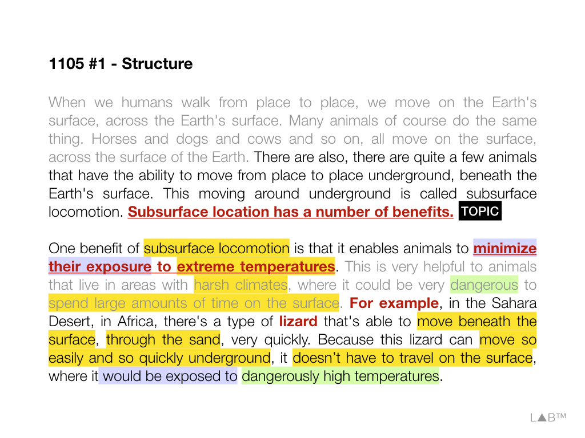
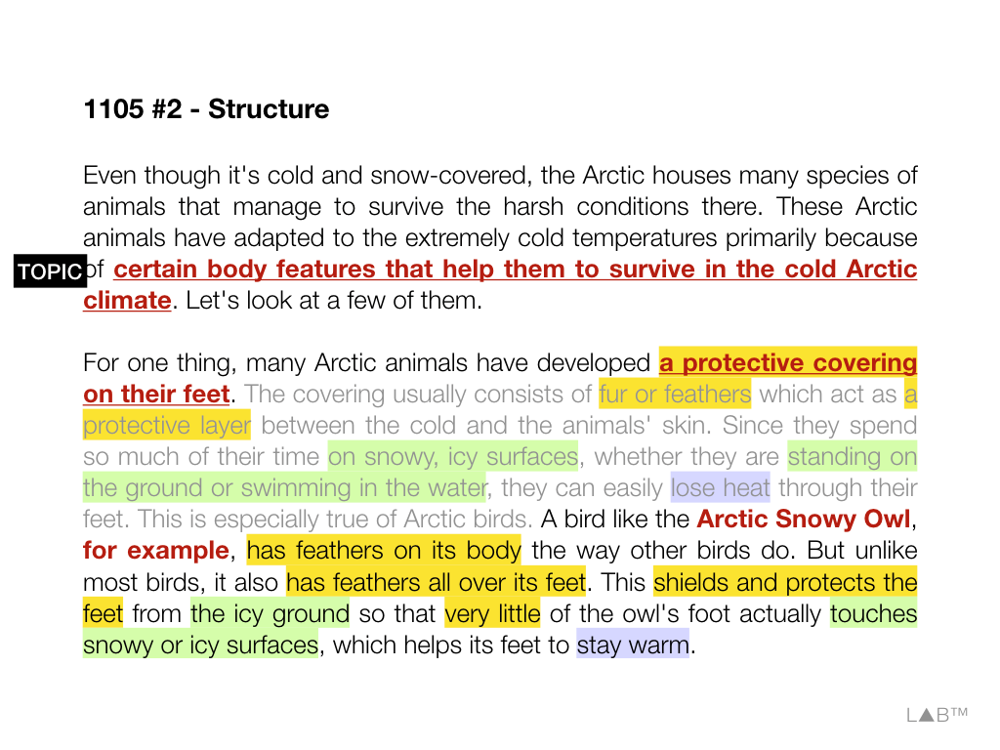
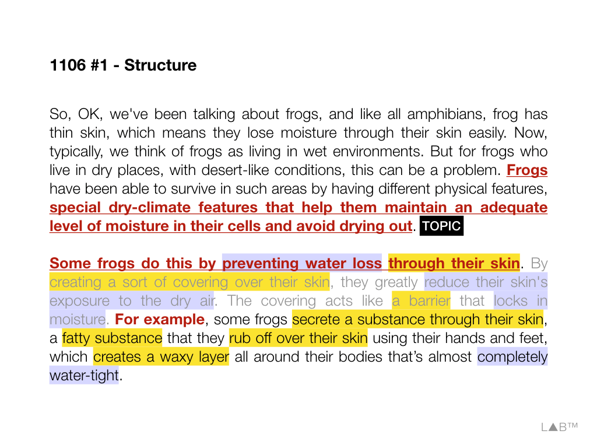
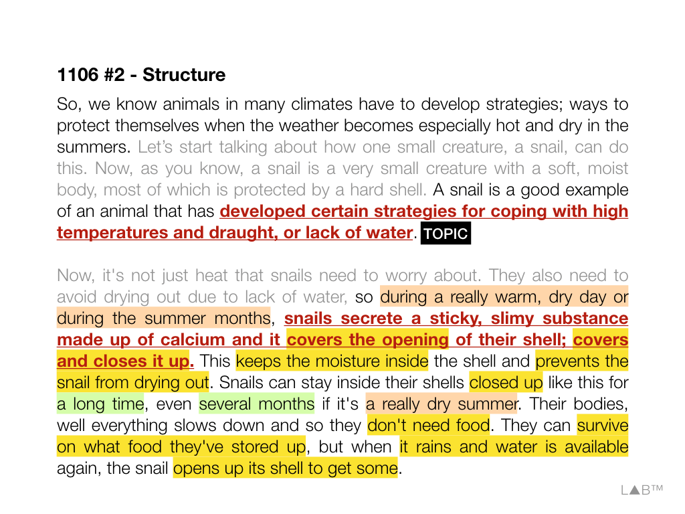
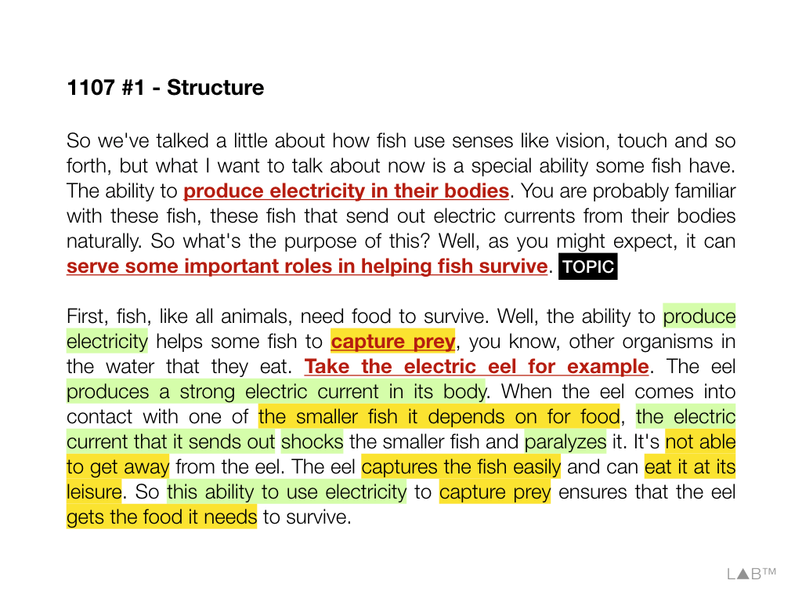
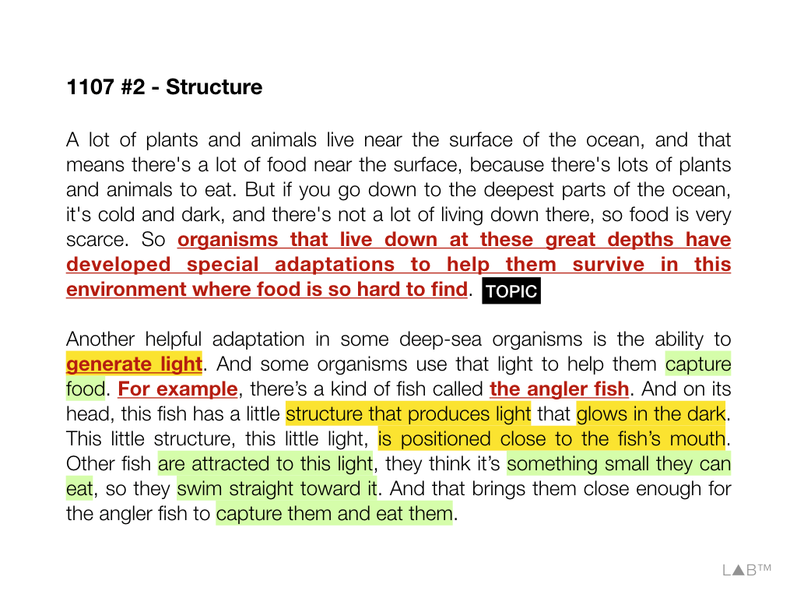
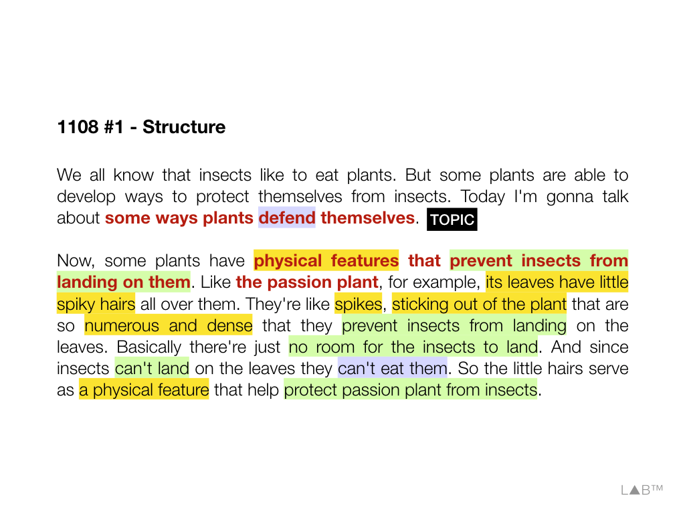
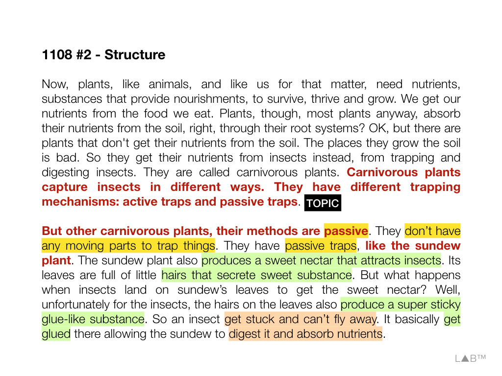
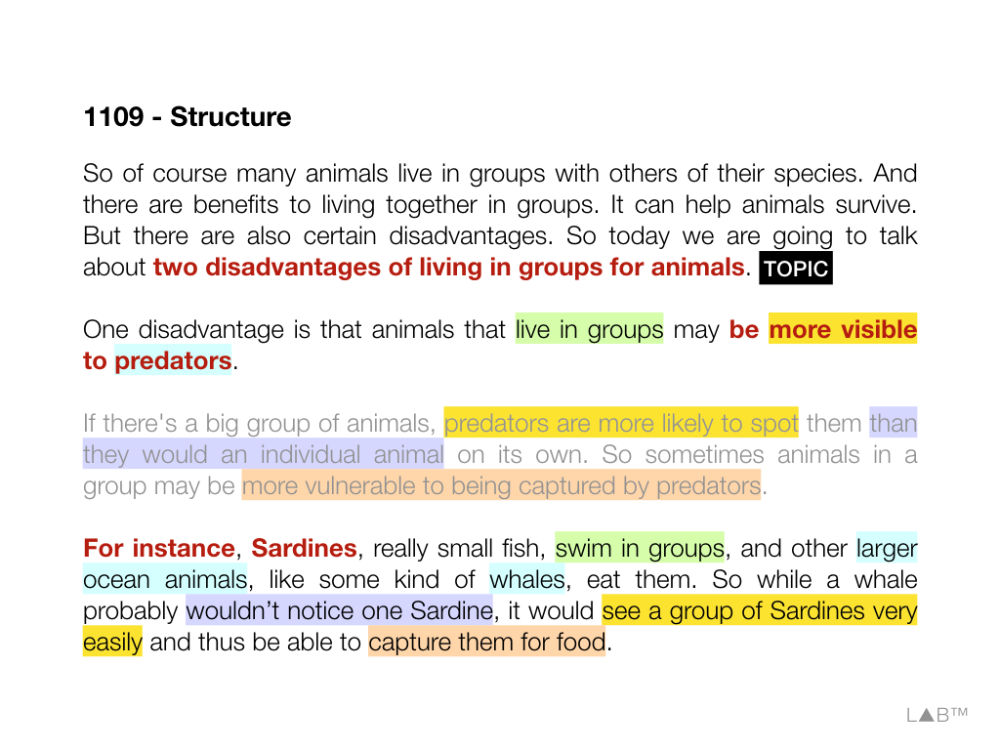
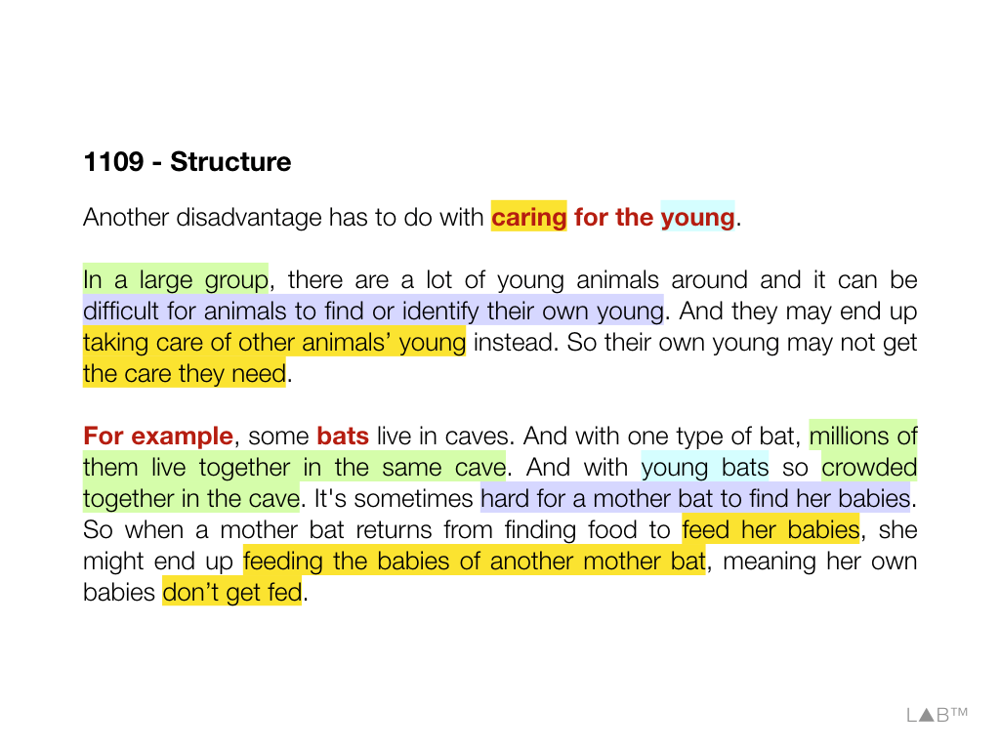

#Task 6

Xavier

## Intro

20s/60s, 60s, 60s

Using points and examples from the lecture, explain two blah.

### Guide

- ***topic sentence***, bold and italic
- *sub aspects*, italic
- <u>example</u>, underlined
- **other detail**, bold
- (echo), in parenthesis

### Template

Well, in the lecture, the professor is talking about ***topic sentence***. (He/She then use two **individual examples to illustrate these**.)

**To begin with**, the professor **indicates** that blah. **Take** sth as an <u>example</u>, blah.

**Then**, the professor **points out** that blah. **For instance, with regard to** <u>blah</u>, blah.

## Guide from Lab - Bio

### Guide

- Paraphrase, within **1 minutes**, the two aspects
- contents of same color are of similar meaning. So speak **only one** of the two, and so only **take note once**.
- Structure
  - opening, :x:
  - **topic sentence**, :white_check_mark:
  - **sub aspects** (in $\color{orange}{\texttt{orange}}$ color), :white_check_mark:
  - link sentence (in $\color{gray}{\texttt{gray}}$ color), :x:
  - **example**, :white_check_mark:
  - **details** (in $\color{green}{\texttt{green}}$ color), ✅

### 181105

#### Expression

- be exposed to
- **minimize/reduce** the exposure to
- **extreme temperature, harsh climate/condition**
- dangerously high temperature/extremely code temperature
- spend large amounts of time **on the surface**
- spend much of one's time **on snowy or icy surface**
- develop a protective covering
- act as a protective layer between ... and ...
- **shield**/protect ... from ...
- stay warm
- lose heat

#### Ref template

The first speaker uses an example to talk about one benefit of moving underground for animals living in \_\_\_ environment. The example is about...

The second speaker mainly tell us how animals that live in \_\_\_ environment develop body features to help survive in \_\_\_ climate. The example is about...

#### Demo

The first speaker uses an example to talk about one benefit of moving underground for animals living in harsh environment. The example is about lizard. The lizard can move easily and quickly through the sand, which means it doesn't have to spend a lot of time travelling on the surface, and this allows the lizard to minimize the exposure to the dangerously high temperatures.

The second speaker mainly tell us how animals that live in extremely cold environment develop body features to help survive in harsh climate. Take snowy owl as an example. It doesn't only have feathers on its body but also has feathers all over its feet, which acts as a protective covering. And this enables the bird to shield its feet from the snowy and icy surfaces, so that its feet can stay warm.

---

### 181106

#### Expression

- loss moisture
- avoid drying out/prevent ... from drying out
- lock in moisture/water-tight
- keep the moisture inside
- maintain an adequate level of moisture
- dry places/desert-like features
- reduce one's exposure to
- create a sort of covering/create a waxy layer
- secrete a fatty substance/secrete a sticky, slimy substance
- **develop strategies for coping with**
- rub off
- survive on
- store up food

#### Ref template

The professor in the first lecture explains how animals like \_\_\_ develop physical features to help maintain an adequate level of moisture in \_\_\_ environment. ...

The other professor illustrates the strategies some animals develop to avoid \_\_\_ due to \_\_\_. Take \_\_\_ as an example, ...

#### Demo

The professor in the first lecture explains how animals like frogs develop physical features to help maintain an adequate level of moisture in **desert-like** environment. So some frogs can secret a kind of fatty substances, and they'll use hands to rob off over the skins, and this is how to create a waxy layer to lock the moisture so the frogs won't dry out.

The second professor illustrates the strategies some animals develop to avoid drying out due to lack of water. Take snail as an example, like during summer month, snails are able to secret a sticky substances, which allows them to cover and to close the opening of the shell, and this helps to keep the moisture inside for even several months. And the snails can survive on the food they store up. Once it rains, the snails will open the shell, to get some water.

### 181107

#### Expression

- organism: animal
- generate: produce, create
- get away from: escape from
- at one's leisure
- send out electric currents
- capture prey: eat prey
- shock and paralyze
- **be positioned** close to
- swim **straight** toward something

#### Ref template

The first speaker mainly talks about how sending out \_\_\_ helps the fish to survive. Take \_\_\_ as an example, ...

The second speaker explains how organisms use their body features to survive in the deep ocean. Take \_\_\_ as an example, ...

#### Demo

Well, the first speaker mainly talks about how sending out electricity helps the fish to survive. Take eel as an example, like, it is able to produce strong electric currents in its body. Whenever it comes into contact other smaller fish, it will use its electric currents to shock and paralyze them to capture them for food.

The second speaker explains how organisms use their body features to survive in the deepest part of the ocean. Take a kind of fish called angler fish as an example, like, it has the structure that can generate light, and this allows it to attract the small fish, because the other small fish think the light is something they can eat. And when the small fish swim close, the angler fish can capture them and eat them.

### 181108

#### Expression

- active/passive trap
- land on
- produce/secret a sweet nectar/substance
- glue-like substance/desert-like condition
- nourishment
- absorb nutrients from
- hair/spiky hair/numerous and dense
- root system
- mechanism

#### Ref template

According to the lecture, carnivorous plants are capable of using passive traps to absorb nutrients from insects. Take \_\_\_ as an example, ...

Also, some plants have certain physical features that will prevent insects from landing on them. For example, ...

#### Demo

According to the lecture, carnivorous plants are capable of using passive traps to absorb nutrients from insects. Take the sundew plants as an example, there're little hairs on its leave, which can secret sweet substances to attract the insects. Once the insects land on the leaves, they will get stuck, because there's also a glue-like substances, produced by the leaves. The plant is able to digest the insects to get the nutrients.

Also, some plants have certain physical features that will prevent insects from landing on them. For example, the passion plants' leaves, have a lot of spiky hairs on them. When insects try to land on the leaves, there's no room for them to do so, because the hairs sticking out are so numerous and dense, which means the insects won't be able to eat the leaves.

### 181109

#### Expression

- be more visible to
- be vulnerable to
- end up doing = wind up doing
- has to do with sth
- some kind of sth

#### Ref template

There are two disadvantages of living in groups for animals.

The first disadvantage is that \_\_\_. For example, ...

The second disadvantage is that \_\_\_. Take \_\_\_ as an example, ...

#### Demo

There are two disadvantages of living in groups for animals.

The first one is that some animal living in groups maybe more visible to predators. For example, when one sardine is swimming in the ocean, its predator will be not noticed, because the sardine is very small. However when a group of sardines swim by, the whale may spot them very easily and be able to capture them for food.

The second one is that it becomes difficult for the mother animals to take care of their own babies. Take bats as an example, usually, a lot of bats will live in the same cave. So when the mother bat returns to the cave and tries to feed her own young, she may end up taking care of the other bats' babies, which means her own young is not been fed.

## TPO 50

So, we've been talking about how animals have developed different ways of ***surviving***. ***And one way is from having developed special physical characteristics that help protect them from the dangers in their environment***. These are known as ***protective adaptation***, and there're ***two*** different kinds. Some animals have *defensive adaptation*, and that means *they protect themselves that make it hard for predators to get at them*. And other animals have *offensive adaptations*, *body structures that keep predators away*.

Alright, <u>let's start with the **turtle**</u>. It's a good example of an animal with *defensive adaptation*. Since you've probably all seen turtles, you already know that it has a **hard shell** that covers its **back** and **vital organs**.(Its shell is its special **physical characteristic**, and it's so **strong**, it **won't break** or **split open**, making it very **hard** for a **predator** to **get at** it). The turtle also has a **flexible neck**, so it can pull its **head** down under its **shell**. It's **legs** can also **fold up** under the **shell** and provide **more protection** still.

Alright, but now <u>let's talk about the **porcupine**</u>. That's an animal that protects itself with an *offensive adaptation* by threatening a predator with *physical harm*. Um, in case you haven't seen a porcupine recently, just imagine an animal with a small body that is covered with thousands of **long, sharp needle-like quills**. Those quills are its special **physical characteristic**. So whenever a **predator** gets too **near**, when it **brushes against** the <u>**porcupine**</u>, those sharp **quills** come **loose** and became **embedded** in the **predator's skin**. So **predators** know enough to **stay away** because they see the porcupines' **threatening quills** and they don't want to **risk** being **hurt** by them.

> Using points and examples from the lecture, explain two different protective adaptations.

## TPO 49

So, of course, many animals live in groups with others of their species. And there're benefits to living together in groups, it can help animals survive, but there're also certain disadvantages. So today we're talk about ***two disadvantages of living in groups for animals***.

One disadvantage is that *animals that live in groups may be more **visible** to **predators***. If there's a **big group** of animals, predators are more likely to **spot** them than they would an individual animal on its own. So sometimes, animals in groups may be more vulnerable to being captured by predators. For instance, <u>sardines</u>, really small fish, **swim** in **groups**, and other large ocean animals, like some kinds of **whales**, eat them. So while a whale probably wouldn't **notice one** sardine, it'd see a **group** of sardines very **easily** and thus be able to **capture** them for food.

Another disadvantage *has to do with **caring** for the **young***. In a large group, there're a lot of young animals around, and it can be difficult for animals to find or **identified** their own young, and they may end up taking care of **other** animals' young instead. So their own young, may not get the care they need. For example, <u>some bats</u> live in caves, and with <u>one type of bat</u>, millions of them live together in the same cave, and with young bats so **crowded** together in the cave, that it's sometime **hard** for a mother bat to **find** her babies. So when a mother bat **returns** form finding food to **feed** her babies, she might **end up** feeding the babies of **another** mother bat, meaning her **own** babies **don't** get fed.

> Using points and examples from the lecture, explain two disadvantages of living in groups for animals.

